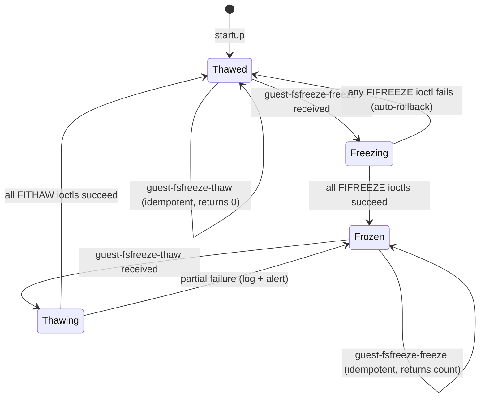
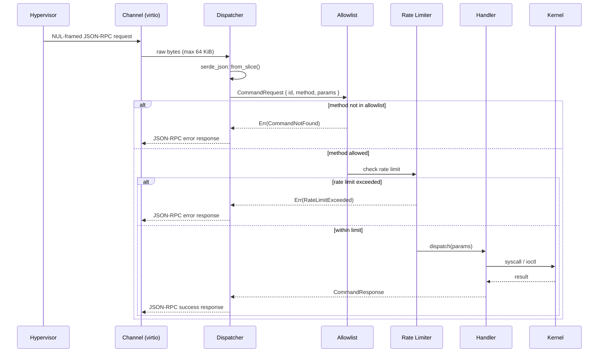

# qeminga — Design Document

## Minimum Secure Subset of QEMU Guest Agent in Rust

**Status:** Draft  
**Last updated:** 2026-08-16

---

## 1. Background and Motivation

The upstream QEMU Guest Agent (`qemu-ga`) is a C daemon that runs inside a virtual machine and exposes a rich command set to the hypervisor via a `virtio-serial` or `isa-serial` channel. While powerful, this broad command surface creates a significant attack vector: a compromised hypervisor layer, a rogue management plane, or a misconfigured orchestration system can instruct the guest agent to execute arbitrary shell commands, write arbitrary files, or manipulate running processes.

**qeminga** replaces `qemu-ga` with a Rust daemon that exposes only the commands required for safe VM lifecycle management, and refuses or ignores every command that could allow the host to gain privileged control of the guest operating system.

### 1.1 Goals

| # | Goal |
|---|------|
| G1 | Support graceful reboot and power-off initiated by the hypervisor. |
| G2 | Support filesystem freeze/thaw (`guest-fsfreeze-freeze` / `guest-fsfreeze-thaw`) so hypervisor-initiated snapshots are crash-consistent. |
| G3 | Report guest information (OS version, file-system state, agent version) so the hypervisor can make informed decisions. |
| G4 | Support guest-initiated network interface enumeration (read-only, used during cloud-init / IP reporting). |
| G5 | Refuse **all** commands that execute arbitrary code, write arbitrary files, or modify guest users/passwords. |
| G6 | Operate with the minimum OS privileges required (non-root where possible, capability-dropped where root is unavoidable). |
| G7 | Be auditable: every command received and its disposition (accepted / denied) is logged. |
| G8 | Written in safe Rust; `unsafe` blocks are forbidden except in a single, explicitly reviewed FFI shim for `ioctl`-level freeze operations. |

### 1.2 Non-Goals

- Full `qemu-ga` protocol compatibility (only a strict subset is implemented).
- Guest-initiated communication toward the hypervisor beyond heartbeat/info replies.
- Dynamic plugin loading or scripting hooks.

---

## 2. Threat Model

### 2.1 Trust Boundaries

```mermaid
graph TD
    subgraph HypervisorSide["Hypervisor / Management Plane (UNTRUSTED)"]
        H[Host Management API]
        QMP[QEMU Monitor Protocol]
    end

    subgraph Channel["virtio-serial channel\n(bidirectional, framed)"]
        VC[/dev/virtio-ports/org.qemu.guest_agent.0/]
    end

    subgraph GuestSide["Guest OS (TRUSTED)"]
        DA[qeminga daemon]
        AL[Allowlist Dispatcher]
        KB[Kernel / syscall boundary]
        FS[Filesystems]
        PM[Power Management]
    end

    H -->|JSON-RPC commands| QMP
    QMP -->|framed JSON| VC
    VC -->|raw bytes| DA
    DA -->|parsed command| AL
    AL -->|allowed| KB
    AL -->|denied — log + error reply| DA
    KB -->|FIFREEZE / FITHAW ioctl| FS
    KB -->|reboot(2) / halt(2)| PM
```

The hypervisor is treated as **untrusted input**. Every byte arriving from the virtio-serial channel is adversarial data from qeminga's perspective.

### 2.2 Attacker Capabilities

| Capability | In scope? |
|---|---|
| Hypervisor sends malformed / oversized JSON | ✅ Yes |
| Hypervisor sends a valid but disallowed command | ✅ Yes |
| Hypervisor replays or floods commands | ✅ Yes |
| Hypervisor sends a valid allowed command at the wrong lifecycle phase | ✅ Yes |
| Local guest process injects into the virtio channel | ❌ Out of scope (OS-level isolation) |
| Physical memory access by the hypervisor | ❌ Out of scope (hardware / trusted-execution domain) |

### 2.3 Denied Command Categories

The following upstream `qemu-ga` command families are **explicitly denied** by design:

| Category | Examples | Reason for denial |
|---|---|---|
| Arbitrary execution | `guest-exec`, `guest-exec-status` | Direct code execution on guest |
| File I/O | `guest-file-open`, `guest-file-read`, `guest-file-write`, `guest-file-close`, `guest-file-seek`, `guest-file-flush` | Read/write of arbitrary guest files |
| User management | `guest-set-user-password` | Credential manipulation |
| SSH key injection | `guest-ssh-add-authorized-keys`, `guest-ssh-remove-authorized-keys`, `guest-ssh-get-authorized-keys` | Persistent backdoor creation |
| Time synchronization | `guest-set-time` | Can disrupt security protocols (TLS, Kerberos) |
| Timezone / locale change | `guest-set-timezone` | Operational disruption |

---

## 3. Allowed Command Set

Only the commands in the following table are implemented. All other commands receive a `{"error": {"class": "CommandNotFound", "desc": "..."}}` response.

| Command | Direction | Description |
|---|---|---|
| `guest-ping` | host → guest | Liveness check; replies `{}` |
| `guest-info` | host → guest | Returns agent version and capability list |
| `guest-sync` | host → guest | Synchronises the request ID for in-flight message tracking |
| `guest-sync-delimited` | host → guest | Variant of `guest-sync` with NUL framing |
| `guest-get-osinfo` | host → guest | Returns OS name, kernel version, machine ID (read-only) |
| `guest-get-interfaces` | host → guest | Returns network interface names + IP addresses (read-only) |
| `guest-get-fsinfo` | host → guest | Returns mounted filesystem metadata (name, type, mountpoint, total/free bytes) |
| `guest-fsfreeze-status` | host → guest | Returns `"thawed"` or `"frozen"` |
| `guest-fsfreeze-freeze` | host → guest | Calls `FIFREEZE` on all mounted filesystems; returns count of frozen FSes |
| `guest-fsfreeze-freeze-list` | host → guest | As above but for a specified list of mountpoints |
| `guest-fsfreeze-thaw` | host → guest | Calls `FITHAW` on all frozen filesystems; returns count of thawed FSes |
| `guest-fstrim` | host → guest | Calls `FITRIM` ioctl to discard unused blocks (storage efficiency) |
| `guest-shutdown` | host → guest | Initiates a clean `systemctl poweroff` or `reboot` via `reboot(2)` after a configurable delay |
| `guest-suspend-ram` | host → guest | Suspends guest to RAM (S3) — **optional, compile-time feature flag** |

---

## 4. Architecture

### 4.1 Component Overview

```mermaid
graph LR
    subgraph IO["I/O Layer"]
        CH[Channel Reader\nAsyncBufReader over virtio fd]
        CW[Channel Writer\nAsyncBufWriter]
    end

    subgraph Protocol["Protocol Layer"]
        FD[Frame Decoder\nNUL-delimited JSON-RPC]
        FE[Frame Encoder]
        RPC[JSON-RPC Dispatcher]
    end

    subgraph Security["Security Layer"]
        AL[Allowlist\nstatic match arms only]
        RL[Rate Limiter\ntoken bucket per command]
        ST[State Machine\nFreezeState enum]
    end

    subgraph Handlers["Command Handlers"]
        HP[guest-ping]
        HI[guest-info]
        HO[guest-get-osinfo]
        HN[guest-get-interfaces]
        HFS[guest-get-fsinfo]
        HFF[guest-fsfreeze-*]
        HS[guest-shutdown]
    end

    subgraph Kernel["Kernel Interface (FFI shim)"]
        KI[ioctl wrapper\nFIFREEZE / FITHAW / FITRIM]
        KS[shutdown wrapper\nreboot(2)]
    end

    subgraph Logging["Structured Logging"]
        LOG[tracing / tracing-subscriber\nJSON output to stderr]
    end

    CH --> FD --> RPC
    RPC --> AL
    AL -->|allowed| RL --> ST --> Handlers
    AL -->|denied| FE
    Handlers --> KI
    Handlers --> KS
    Handlers --> FE
    FE --> CW
    Handlers --> LOG
    AL --> LOG
```

### 4.2 State Machine — Freeze State

fsfreeze operations must be serialised. qeminga tracks freeze state explicitly:



### 4.3 Request Lifecycle



---

## 5. Security Design Decisions

### 5.1 Static Allowlist via Match Arms

The dispatcher uses a `match` expression on the method string. There is **no dynamic dispatch table**, no plugin loader, and no way to register new handlers at runtime. Adding a command requires a source-code change, a code review, and a new release.

```rust
// Sketch — see src/dispatch.rs for full implementation
match req.method.as_str() {
    "guest-ping"              => handlers::ping(req),
    "guest-info"              => handlers::info(req),
    "guest-sync"              => handlers::sync(req),
    "guest-sync-delimited"    => handlers::sync_delimited(req),
    "guest-get-osinfo"        => handlers::get_osinfo(req),
    "guest-get-interfaces"    => handlers::get_interfaces(req),
    "guest-get-fsinfo"        => handlers::get_fsinfo(req),
    "guest-fsfreeze-status"   => handlers::fsfreeze_status(req),
    "guest-fsfreeze-freeze"   => handlers::fsfreeze_freeze(req),
    "guest-fsfreeze-freeze-list" => handlers::fsfreeze_freeze_list(req),
    "guest-fsfreeze-thaw"     => handlers::fsfreeze_thaw(req),
    "guest-fstrim"            => handlers::fstrim(req),
    "guest-shutdown"          => handlers::shutdown(req),
    _                         => Err(Error::CommandNotFound(req.method)),
}
```

### 5.2 Input Size Limits

The frame decoder enforces a hard maximum of **65,536 bytes** per JSON-RPC message. Oversized frames are dropped and an error is returned without parsing the content, preventing memory exhaustion from deeply nested or padded JSON.

### 5.3 Rate Limiting

Each command class has a per-minute quota enforced by a token-bucket limiter:

| Command class | Quota |
|---|---|
| `guest-ping`, `guest-sync*` | 120 / min |
| `guest-get-*` | 30 / min |
| `guest-fsfreeze-*`, `guest-fstrim` | 10 / min |
| `guest-shutdown` | 2 / min |

### 5.4 Capability Dropping (Linux)

At startup, after opening `/dev/virtio-ports/org.qemu.guest_agent.0`, qeminga calls `prctl(PR_SET_NO_NEW_PRIVS, 1)` and drops all Linux capabilities except:

| Capability | Required for |
|---|---|
| `CAP_SYS_ADMIN` | `FIFREEZE` / `FITHAW` ioctls and `mount` namespace queries |
| `CAP_SYS_BOOT` | `reboot(2)` syscall |

All other capabilities (`CAP_NET_ADMIN`, `CAP_DAC_READ_SEARCH`, `CAP_SETUID`, etc.) are permanently dropped. The process runs as a dedicated `qeminga` system user (UID/GID 600 by convention).

### 5.5 Seccomp Filter (optional, recommended)

When compiled with the `seccomp` feature flag, qeminga installs a `SECCOMP_MODE_FILTER` policy that allows only:

```
read, write, close, ioctl (FIFREEZE/FITHAW/FITRIM subset),
reboot, exit_group, rt_sigreturn, getpid, gettid, mmap (MAP_ANONYMOUS),
brk, futex, clock_gettime, getrandom
```

All other syscalls cause `SIGSYS`, terminating the process rather than allowing an exploit to pivot.

### 5.6 No `unsafe` Outside the Kernel Shim

The `kernel` module is the single location permitted to use `unsafe`. It is gated behind a crate-internal `mod kernel` with `#[cfg(target_os = "linux")]`. All callers go through safe Rust wrappers that return `Result<T, KernelError>`.

---

## 6. Module Structure

```
qeminga/
├── Cargo.toml
├── docs/
│   └── design.md          ← this file
└── src/
    ├── main.rs            # entry point: parse config, drop caps, start async runtime
    ├── config.rs          # configuration struct (channel path, log level, rate limits)
    ├── channel.rs         # open + read/write virtio-serial fd
    ├── framing.rs         # NUL-delimited frame decoder / encoder
    ├── proto.rs           # JSON-RPC types (Request, Response, Error)
    ├── dispatch.rs        # static allowlist match + rate limiter
    ├── state.rs           # FreezeState enum + Mutex-guarded singleton
    ├── handlers/
    │   ├── mod.rs
    │   ├── ping.rs
    │   ├── info.rs
    │   ├── osinfo.rs
    │   ├── interfaces.rs
    │   ├── fsinfo.rs
    │   ├── fsfreeze.rs    # freeze, freeze-list, thaw, status, fstrim
    │   └── shutdown.rs
    └── kernel/
        ├── mod.rs         # safe wrappers, re-exports
        ├── ioctl.rs       # unsafe: FIFREEZE/FITHAW/FITRIM via nix
        ├── shutdown.rs    # unsafe: reboot(2) via nix
        └── caps.rs        # capability dropping via caps crate
```

---

## 7. Key Dependencies

| Crate | Version | Purpose |
|---|---|---|
| `tokio` | 1.x | Async runtime (single-threaded suffices) |
| `serde` / `serde_json` | 1.x | JSON serialisation |
| `nix` | 0.27.x | Safe-ish wrappers for Linux syscalls and ioctls |
| `caps` | 0.5.x | Linux capability dropping |
| `tracing` | 0.1.x | Structured logging |
| `tracing-subscriber` | 0.3.x | Log formatting (JSON output) |
| `thiserror` | 1.x | Error type derivation |
| `governor` | 0.6.x | Token-bucket rate limiter |
| `seccompiler` | 0.4.x | Seccomp BPF filter (optional feature) |

---

## 8. Configuration

qeminga reads a TOML configuration file (default: `/etc/qeminga/config.toml`):

```toml
[agent]
channel_path = "/dev/virtio-ports/org.qemu.guest_agent.0"
log_level     = "info"   # trace | debug | info | warn | error
version       = "1.0.0"

[rate_limits]
ping_sync_per_min     = 120
get_commands_per_min  = 30
fsfreeze_per_min      = 10
shutdown_per_min      = 2

[features]
suspend_ram = false
seccomp     = true
```

---

## 9. Audit Log Format

Every received command is logged as a structured JSON line to `stderr`, captured by the service manager (e.g., `systemd`):

```json
{
  "timestamp": "2026-08-16T20:00:00.000Z",
  "level": "INFO",
  "event": "command_received",
  "method": "guest-fsfreeze-freeze",
  "id": 42,
  "disposition": "allowed",
  "freeze_state_before": "thawed"
}
```

Denied commands use `"disposition": "denied"` and include `"reason"`.

---

## 10. Open Questions

| # | Question | Owner |
|---|---|---|
| OQ1 | Should `guest-suspend-ram` be allowed by default? It can disrupt security monitoring. Recommend opt-in via feature flag. | Architecture |
| OQ2 | Should `guest-fstrim` be included? It leaks storage usage patterns to the hypervisor. Low risk but worth discussing. | Security |
| OQ3 | What is the threat model for the configuration file itself? If the host can write `/etc/qeminga/config.toml`, it can adjust rate limits. Consider signing or embedding config at compile time. | Security |
| OQ4 | Is a watchdog timer needed to auto-thaw filesystems if the hypervisor crashes mid-snapshot? | Reliability |

---

## 11. Acceptance Criteria

| ID | Criterion |
|---|---|
| AC1 | `guest-exec` and all other denied commands return `{"error": {"class": "CommandNotFound", ...}}`. |
| AC2 | `guest-fsfreeze-freeze` followed by `guest-fsfreeze-thaw` succeeds on a real Linux ext4 or xfs filesystem. |
| AC3 | The daemon starts with only `CAP_SYS_ADMIN` and `CAP_SYS_BOOT` in its effective set. |
| AC4 | An oversized (> 64 KiB) frame is rejected without crashing the daemon. |
| AC5 | A flood of 1000 `guest-ping` requests within one second is rate-limited; the daemon continues serving subsequent valid requests. |
| AC6 | `cargo audit` reports zero known vulnerabilities in the dependency tree. |
| AC7 | `cargo clippy -- -D warnings` produces zero warnings. |
| AC8 | All unit tests pass under `cargo test`. |
