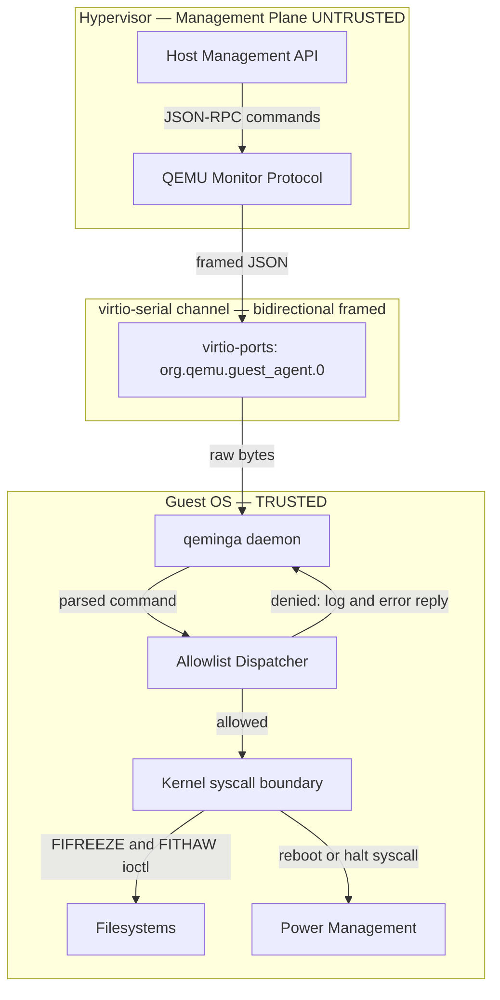
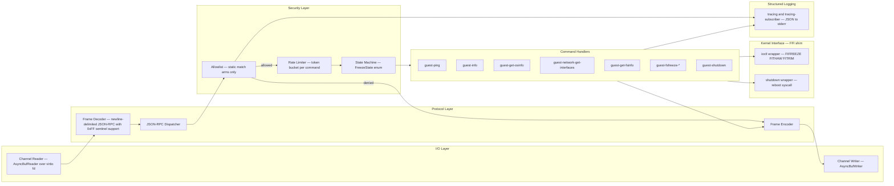
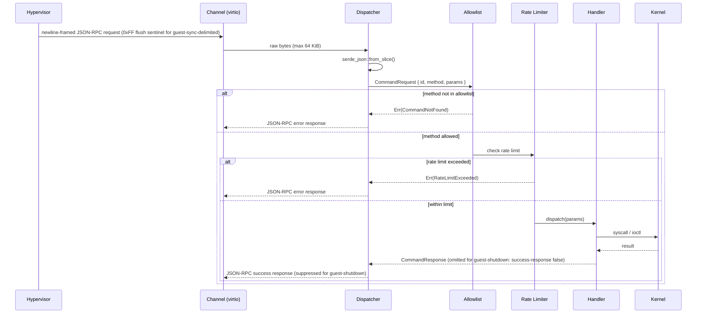

# qeminga — Design Document

## Minimum Secure Subset of QEMU Guest Agent in Rust

**Status:** Draft  
**Last updated:** 2026-08-16

---

## 1. Background and Motivation

The upstream QEMU Guest Agent (`qemu-ga`) is a C daemon that runs inside a virtual machine and exposes a rich command set to the hypervisor via a `virtio-serial` or `isa-serial` channel. While powerful, this broad command surface creates a significant attack vector: a compromised hypervisor layer, a rogue management plane, or a misconfigured orchestration system can instruct the guest agent to execute arbitrary shell commands, write arbitrary files, or manipulate running processes.

**qeminga** replaces `qemu-ga` with a Rust daemon that exposes only the commands required for safe VM lifecycle management, and refuses or ignores every command that could allow the host to gain privileged control of the guest operating system.

### 1.1 Goals

| # | Goal |
|---|------|
| G1 | Support graceful reboot and power-off initiated by the hypervisor. |
| G2 | Support filesystem freeze/thaw (`guest-fsfreeze-freeze` / `guest-fsfreeze-thaw`) so hypervisor-initiated snapshots are crash-consistent. |
| G3 | Report guest information (OS version, file-system state, agent version) so the hypervisor can make informed decisions. |
| G4 | Support guest-initiated network interface enumeration (read-only, used during cloud-init / IP reporting). |
| G5 | Refuse **all** commands that execute arbitrary code, write arbitrary files, or modify guest users/passwords. |
| G6 | Operate with the minimum OS privileges required (non-root where possible, capability-dropped where root is unavoidable). |
| G7 | Be auditable: every command received and its disposition (accepted / denied) is logged. |
| G8 | Written in safe Rust; `unsafe` blocks are forbidden except in a single, explicitly reviewed FFI shim for `ioctl`-level freeze operations. |

### 1.2 Non-Goals

- Full `qemu-ga` protocol compatibility (only a strict subset is implemented).
- Guest-initiated communication toward the hypervisor beyond heartbeat/info replies.
- Dynamic plugin loading or scripting hooks.

---

## 2. Threat Model

### 2.1 Trust Boundaries



The hypervisor is treated as **untrusted input**. Every byte arriving from the virtio-serial channel is adversarial data from qeminga's perspective.

### 2.2 Attacker Capabilities

| Capability | In scope? |
|---|---|
| Hypervisor sends malformed / oversized JSON | ✅ Yes |
| Hypervisor sends a valid but disallowed command | ✅ Yes |
| Hypervisor replays or floods commands | ✅ Yes |
| Hypervisor sends a valid allowed command at the wrong lifecycle phase | ✅ Yes |
| Local guest process injects into the virtio channel | ❌ Out of scope (single-open device; access controlled by udev rule `0600 root:qeminga` — §8 documents the required rule) |
| Physical memory access by the hypervisor | ❌ Out of scope (hardware / trusted-execution domain) |

### 2.3 Denied Command Categories

The following upstream `qemu-ga` command families are **explicitly denied** by design:

| Category | Examples | Reason for denial |
|---|---|---|
| Arbitrary execution | `guest-exec`, `guest-exec-status` | Direct code execution on guest |
| File I/O | `guest-file-open`, `guest-file-read`, `guest-file-write`, `guest-file-close`, `guest-file-seek`, `guest-file-flush` | Read/write of arbitrary guest files |
| User management | `guest-set-user-password` | Credential manipulation |
| SSH key injection | `guest-ssh-add-authorized-keys`, `guest-ssh-remove-authorized-keys`, `guest-ssh-get-authorized-keys` | Persistent backdoor creation |
| Time synchronization | `guest-set-time` | Can disrupt security protocols (TLS, Kerberos) |
| Timezone mutation | `guest-set-timezone` does not exist in upstream `qemu-ga`; no action needed |  |
| Read-only info commands denied in this release | `guest-get-users`, `guest-get-host-name`, `guest-get-time`, `guest-get-timezone`, `guest-get-devices`, `guest-get-disks`, `guest-get-memory-blocks`, `guest-get-memory-block-info` | Not required for snapshot or lifecycle operations; each expands the read surface exposed to the host |

---

## 3. Allowed Command Set

Only the commands in the following table are implemented. All other commands receive a `{"error": {"class": "CommandNotFound", "desc": "..."}}` response.

| Command | Direction | Description |
|---|---|---|
| `guest-ping` | host → guest | Liveness check; replies `{}` |
| `guest-info` | host → guest | Returns agent version and capability list |
| `guest-sync` | host → guest | Synchronises the request ID for in-flight message tracking |
| `guest-sync-delimited` | host → guest | Echo back the sync ID; prepend a `0xFF` sentinel byte to the response (and expect one in the request) so clients can flush stale partial JSON from a previous connection |
| `guest-get-osinfo` | host → guest | Returns OS name, kernel release, kernel version, machine architecture, and `/etc/os-release` fields `ID`, `NAME`, `PRETTY_NAME`, `VERSION`, `VERSION_ID`, `VARIANT`, `VARIANT_ID` (read-only; **does not** return `/etc/machine-id`) |
| `guest-network-get-interfaces` | host → guest | Returns interface names, hardware addresses, and unicast IP addresses (read-only); loopback and link-local addresses are filtered out to limit host visibility into overlay and management networks |
| `guest-get-fsinfo` | host → guest | Returns mounted filesystem metadata (name, type, mountpoint, total/free bytes) |
| `guest-fsfreeze-status` | host → guest | Returns `"thawed"` or `"frozen"` |
| `guest-fsfreeze-freeze` | host → guest | Calls `FIFREEZE` on all mounted filesystems; returns count of frozen FSes |
| `guest-fsfreeze-freeze-list` | host → guest | As above but for a specified list of mountpoints |
| `guest-fsfreeze-thaw` | host → guest | Calls `FITHAW` on all frozen filesystems; returns count of thawed FSes |
| `guest-fstrim` | host → guest | Calls `FITRIM` ioctl to discard unused blocks (storage efficiency) |
| `guest-shutdown` | host → guest | Initiates a clean shutdown. Accepts optional `mode` ∈ `{"halt", "poweroff", "reboot"}` (default `"poweroff"`). **Does not send a success reply** (`success-response: false` upstream); errors are still reported. Clients watch for VM exit. |
| `guest-suspend-ram` | host → guest | Suspends guest to RAM (S3) — **opt-in, disabled by default** via `[features] suspend_ram = false` in `config.toml` |

---

## 4. Architecture

### 4.1 Component Overview



### 4.2 State Machine — Freeze State

fsfreeze operations must be serialised. qeminga tracks freeze state explicitly:

```mermaid
stateDiagram-v2
    [*] --> Thawed : startup

    Thawed --> Freezing : guest-fsfreeze-freeze received
    Freezing --> Frozen : all FIFREEZE ioctls return 0 or EOPNOTSUPP or EBUSY
    Freezing --> Thawed : hard ioctl error other than EOPNOTSUPP or EBUSY (auto-rollback FITHAW all frozen)

    Frozen --> Thawing : guest-fsfreeze-thaw received
    Frozen --> Thawing : watchdog deadline reached
    Thawing --> Thawed : all FITHAW ioctls complete
    Thawing --> Frozen : partial FITHAW failure (log alert; continue retrying)

    Frozen --> Frozen : guest-fsfreeze-freeze received (idempotent; returns frozen count)
    Thawed --> Thawed : guest-fsfreeze-thaw received (idempotent; returns 0)
```



**Errno handling during freeze:**
- `EOPNOTSUPP` — the filesystem does not implement freeze (e.g. tmpfs, proc). Counted as skipped, not as frozen.
- `EBUSY` — the superblock is already frozen. This is normal for bind mounts sharing the same superblock. Counted in the frozen total.
- Any other errno — treated as a hard error. All previously frozen filesystems are thawed immediately (rollback), and the state returns to `Thawed`.

### 4.3 Request Lifecycle



### 4.4 Freeze Watchdog

A freeze watchdog runs as a dedicated `spawn_blocking` task on the tokio thread pool. It ensures that a hypervisor crash or a network partition mid-snapshot does not leave the guest permanently frozen.

**Arming:** the watchdog is armed when the state transitions to `Frozen`. Its deadline is `now + fsfreeze_idle_timeout_secs`.

**Refreshing:** any `guest-fsfreeze-status` request received while `Frozen` resets the deadline to `now + fsfreeze_idle_timeout_secs`. This lets a live backup orchestrator hold the freeze open by polling, while a dead one loses it.

**Hard cap:** the deadline is capped at `arm_time + fsfreeze_max_timeout_secs` regardless of status heartbeats. A legitimately long backup that exceeds `fsfreeze_max_timeout_secs` will be auto-thawed; this is preferable to hanging indefinitely.

**Disarming:** the watchdog is cancelled when the state transitions back to `Thawed` (whether via a normal `guest-fsfreeze-thaw` or via the watchdog itself).

**Blocking requirement:** the `FITHAW` ioctls issued by the watchdog must run on `spawn_blocking`, not on the async reactor, for the same reason as §7: they block until writeback drains.

---

## 5. Security Design Decisions

### 5.1 Static Allowlist via Match Arms

The dispatcher uses a `match` expression on the method string. There is **no dynamic dispatch table**, no plugin loader, and no way to register new handlers at runtime. Adding a command requires a source-code change, a code review, and a new release.

```rust
// Sketch — see src/dispatch.rs for full implementation
match req.method.as_str() {
    "guest-ping"              => handlers::ping(req),
    "guest-info"              => handlers::info(req),
    "guest-sync"              => handlers::sync(req),
    "guest-sync-delimited"    => handlers::sync_delimited(req),
    "guest-get-osinfo"        => handlers::get_osinfo(req),
    "guest-network-get-interfaces" => handlers::get_interfaces(req),
    "guest-get-fsinfo"        => handlers::get_fsinfo(req),
    "guest-fsfreeze-status"   => handlers::fsfreeze_status(req),
    "guest-fsfreeze-freeze"   => handlers::fsfreeze_freeze(req),
    "guest-fsfreeze-freeze-list" => handlers::fsfreeze_freeze_list(req),
    "guest-fsfreeze-thaw"     => handlers::fsfreeze_thaw(req),
    "guest-fstrim"            => handlers::fstrim(req),
    "guest-shutdown"          => handlers::shutdown(req),
    _                         => Err(Error::CommandNotFound(req.method)),
}
```

### 5.2 Input Size Limits and Resynchronisation

The frame decoder enforces three hard limits before handing data to the JSON parser:

1. **Frame length:** 65,536 bytes maximum per JSON-RPC message. An oversized frame is not silently dropped — the decoder enters a **discard-until-newline** state, consuming and discarding bytes until the next `\n` frame delimiter is found before resuming normal operation. This prevents the tail of an oversized blob from being parsed as the next command. The `0xFF` sentinel byte in a `guest-sync-delimited` request also forces an exit from the discard state.

2. **JSON nesting depth:** `serde_json` is configured with a maximum nesting depth of **32 levels**. Deeply nested objects are a common amplification vector for recursive-descent parsers.

3. **String field length:** individual JSON string values are capped at **4,096 bytes** via a custom deserialiser visitor, preventing memory exhaustion from a single oversized string that stays within the overall frame limit.

### 5.3 Rate Limiting

Each command class has a per-minute quota enforced by a token-bucket limiter:

| Command class | Quota | Notes |
|---|---|---|
| `guest-ping`, `guest-sync*` | 120 / min | |
| `guest-get-*`, `guest-network-get-interfaces` | 30 / min | |
| `guest-fsfreeze-freeze`, `guest-fsfreeze-freeze-list` | 10 / min | Freeze is rate-limited |
| `guest-fsfreeze-status`, `guest-fsfreeze-thaw` | **unlimited** | **Thaw is never rate-limited.** A frozen filesystem must always be thaw-able; denying a thaw would make the agent's own DoS control the DoS. |
| `guest-fstrim` | 5 / min | |
| `guest-shutdown`, `guest-suspend-ram` | 2 / min | Decorative — a host that can call shutdown can also cut power; rate limit is a last-resort circuit-breaker, not a meaningful defence. |

**While the agent is in `Frozen` state**, only the frozen-safe command set is accepted regardless of rate-limiter state: `guest-fsfreeze-status`, `guest-fsfreeze-thaw`, `guest-ping`, `guest-sync`, `guest-sync-delimited`, and `guest-info`. All other commands are rejected with `{"error": {"class": "FrozenGuest", ...}}` until the filesystems are thawed.

### 5.4 Capability Dropping (Linux)

At startup, after opening the virtio channel, qeminga calls `prctl(PR_SET_NO_NEW_PRIVS, 1)` and drops all Linux capabilities except:

| Capability | Required for |
|---|---|
| `CAP_SYS_ADMIN` | `FIFREEZE` / `FITHAW` ioctls |
| `CAP_SYS_BOOT` | `reboot(2)` syscall |

All other capabilities (`CAP_NET_ADMIN`, `CAP_DAC_READ_SEARCH`, `CAP_SETUID`, etc.) are permanently dropped. The process runs as a dedicated `qeminga` system user (UID/GID 600 by convention).

> **Important:** `CAP_SYS_ADMIN` is close to retaining root. It covers `mount`, `pivot_root`, `setns`, `bpf` on older kernels, and ioctls across a wide range of kernel subsystems. Running as UID 600 is defence in depth, but G6's "non-root where possible" should not be read as meaningful privilege reduction while `CAP_SYS_ADMIN` is held. The effective security boundary is the seccomp filter (§5.5), not the capability drop.

### 5.5 Seccomp Filter (optional, recommended)

When the `seccomp` Cargo feature is compiled in **and** `[features] seccomp = true` is set in `config.toml`, qeminga installs a `SECCOMP_MODE_FILTER` policy at startup.

The allowlist covers the full syscall surface of a tokio multi-threaded runtime plus the agent's own kernel calls:

```
# I/O and fd management
read, write, readv, writev, close, open, openat, stat, fstat, lstat,
fcntl, ioctl, lseek, pread64, pwrite64

# Memory
brk, mmap, mprotect, munmap, madvise, mremap

# Threads and synchronisation (tokio work-stealing scheduler)
clone, clone3, exit, set_robust_list,
futex, futex_waitv, futex_wait, futex_wake,
sched_getaffinity, sched_yield

# Async I/O reactor
epoll_create1, epoll_ctl, epoll_wait, epoll_pwait,
eventfd2, ppoll, poll

# Signals
rt_sigaction, rt_sigprocmask, rt_sigreturn, sigaltstack

# Time
clock_gettime, clock_nanosleep, nanosleep

# Misc
getrandom, getpid, gettid, getuid, getgid,
exit_group, restart_syscall

# Agent-specific
reboot           # guest-shutdown
ioctl(FIFREEZE)  # guest-fsfreeze-freeze (enforced by argument filter)
ioctl(FITHAW)    # guest-fsfreeze-thaw
ioctl(FITRIM)    # guest-fstrim
```

All other syscalls cause `SIGSYS`, terminating the process rather than allowing an exploit to pivot. The filter is installed **after** capability dropping so that `seccomp(2)` itself does not need to be in the allowlist.

### 5.6 No `unsafe` Outside the Kernel Shim

The `kernel` module is the single location permitted to use `unsafe`. It is gated behind a crate-internal `mod kernel` with `#[cfg(target_os = "linux")]`. All callers go through safe Rust wrappers that return `Result<T, KernelError>`.

---

## 6. Module Structure

```
qeminga/
├── Cargo.toml
├── docs/
│   └── design.md          ← this file
└── src/
    ├── main.rs            # entry point: parse config, drop caps, start async runtime
    ├── config.rs          # configuration struct (channel path, log level, rate limits)
    ├── channel.rs         # open + read/write virtio-serial fd
    ├── framing.rs         # newline-delimited frame decoder/encoder; 0xFF sentinel handling
    ├── proto.rs           # JSON-RPC types (Request, Response, Error)
    ├── dispatch.rs        # static allowlist match + rate limiter
    ├── state.rs           # FreezeState enum + Mutex-guarded singleton
    ├── handlers/
    │   ├── mod.rs
    │   ├── ping.rs
    │   ├── info.rs
    │   ├── osinfo.rs
    │   ├── interfaces.rs  # guest-network-get-interfaces
    │   ├── fsinfo.rs
    │   ├── fsfreeze.rs    # freeze, freeze-list, thaw, status, fstrim
    │   └── shutdown.rs
    └── kernel/
        ├── mod.rs         # safe wrappers, re-exports
        ├── ioctl.rs       # unsafe: FIFREEZE/FITHAW/FITRIM via nix
        ├── shutdown.rs    # unsafe: reboot(2) via nix
        └── caps.rs        # capability dropping via caps crate
```

---

## 7. Key Dependencies

| Crate | Version | Purpose |
|---|---|---|
| `tokio` | 1.x | Async runtime — **multi-threaded** (`tokio::main` with `flavor = "multi_thread"`, min 2 worker threads). `FIFREEZE` and `FITRIM` are blocking syscalls that can stall for seconds; running them on `spawn_blocking` keeps the reactor alive for `guest-ping` and `guest-fsfreeze-thaw` during a long freeze. |
| `serde` / `serde_json` | 1.x | JSON serialisation |
| `nix` | 0.27.x | Safe-ish wrappers for Linux syscalls and ioctls |
| `caps` | 0.5.x | Linux capability dropping |
| `tracing` | 0.1.x | Structured logging |
| `tracing-subscriber` | 0.3.x | Log formatting (JSON output) |
| `thiserror` | 1.x | Error type derivation |
| `governor` | 0.6.x | Token-bucket rate limiter |
| `seccompiler` | 0.4.x | Seccomp BPF filter (optional feature) |

---

## 8. Configuration

### 8.1 Cargo Features vs. Runtime Config

There are two independent switches for optional behaviour:

| Layer | Mechanism | Effect |
|---|---|---|
| **Compile-time** | `cargo build --features <name>` | Includes the code in the binary. A binary without a feature cannot enable it at runtime. |
| **Runtime** | `[features]` in `config.toml` | Enables the compiled-in code. Setting a key whose feature was not compiled in is a warning, not an error. |

The `seccomp` feature and `suspend_ram` feature both follow this two-level pattern. `fstrim` is always compiled in (no Cargo feature gate) but can be disabled at runtime.

### 8.2 Configuration File

qeminga reads a TOML configuration file (default: `/etc/qeminga/config.toml`):

```toml
[agent]
channel_path            = "/dev/virtio-ports/org.qemu.guest_agent.0"
log_level               = "info"   # trace | debug | info | warn | error
version                 = "1.0.0"
fsfreeze_idle_timeout_secs = 30    # auto-thaw if no guest-fsfreeze-status heartbeat received
fsfreeze_max_timeout_secs  = 300   # hard cap; thaw even if heartbeats are arriving

[rate_limits]
ping_sync_per_min          = 120
get_commands_per_min       = 30
fsfreeze_freeze_per_min    = 10
shutdown_per_min           = 2

[features]
# Runtime half of the two-level feature flag (compile-time half: --features)
suspend_ram = false   # opt-in: can disrupt security monitoring
fstrim      = true    # opt-out: discard unused blocks
seccomp     = true    # no effect if binary not compiled with --features seccomp
```

### 8.3 Device Node Permissions

The virtio-serial channel is a **single-open device**: only one process can hold it at a time. This is the primary OS-level isolation between the agent and any other local process. The following udev rule must be installed (e.g. `/etc/udev/rules.d/99-qeminga.rules`):

```
SUBSYSTEM=="virtio-ports", ATTR{name}=="org.qemu.guest_agent.0", \
    OWNER="qeminga", GROUP="qeminga", MODE="0600"
```

Without this rule, any process running as the same user as the agent (or root) can open the channel and send commands directly to QEMU.

---

## 9. Audit Log Format

Every received command is logged as a structured JSON line to `stderr`, captured by the service manager (e.g., `systemd`):

```json
{
  "timestamp": "2026-08-16T20:00:00.000Z",
  "level": "INFO",
  "event": "command_received",
  "method": "guest-fsfreeze-freeze",
  "id": 42,
  "disposition": "allowed",
  "freeze_state_before": "thawed"
}
```

Denied commands use `"disposition": "denied"` and include `"reason"`.

### 9.1 Logging During Freeze — Hazard and Mitigation

**G7 (log every command) and G2 (fsfreeze) are in direct conflict.** After `FIFREEZE`, writes to a frozen superblock block indefinitely in `D` state:

- journald captures `stderr` → writes to `/var/log/journal` (on a frozen filesystem) → journald blocks → its socket buffer fills → the agent's next `tracing` write blocks → the agent can no longer read from the virtio channel → `guest-fsfreeze-thaw` is never received → the guest is permanently frozen. The watchdog task is in the same process and shares the same blocked write path.

**Mitigation:** the agent uses a **fixed-capacity in-memory ring buffer** (512 log entries, ~64 KiB) as the tracing subscriber. Log entries are written to this buffer synchronously (no I/O). A separate background task flushes the ring buffer to `stderr` only when `FreezeState == Thawed`. While frozen, log entries accumulate in memory; if the ring overflows, oldest entries are discarded (a counter is incremented). This preserves the invariant that the main task never blocks on a log write.

---

## 10. Decisions

| # | Decision |
|---|---|
| D1 | `guest-suspend-ram` is **opt-in**: disabled by default. Enable via `[features] suspend_ram = true` in `config.toml`. |
| D2 | `guest-fstrim` is **included**: enabled by default; can be disabled via `[features] fstrim = false` in `config.toml`. |
| D3 | The threat model for the configuration file is **out of scope**: if the host can overwrite `/etc/qeminga/config.toml` it can replace the agent binary entirely. OS-level file permissions are the appropriate control. |
| D4 | A freeze watchdog is **required** and is fully specified in §4.4. The idle timeout defaults to 30 seconds and the hard cap to 300 seconds; both are configurable in `config.toml`. |

---

## 11. Acceptance Criteria

| ID | Criterion |
|---|---|
| AC1 | `guest-exec` and all other denied commands return `{"error": {"class": "CommandNotFound", ...}}`. |
| AC2 | `guest-fsfreeze-freeze` followed by `guest-fsfreeze-thaw` succeeds on a real Linux ext4 or xfs filesystem. |
| AC3 | The daemon starts with only `CAP_SYS_ADMIN` and `CAP_SYS_BOOT` in its effective set. |
| AC4 | An oversized (> 64 KiB) frame is rejected, the decoder re-syncs to the next newline, and the subsequent valid command is handled correctly (no permanent desync). |
| AC5 | A flood of 1000 `guest-ping` requests within one second is rate-limited; the daemon continues serving subsequent valid requests. |
| AC6 | `cargo audit` reports zero known vulnerabilities in the dependency tree. |
| AC7 | `cargo clippy -- -D warnings` produces zero warnings. |
| AC8 | All unit tests pass under `cargo test`. |
| AC9 | While `Frozen`, every command outside the frozen-safe set is rejected with `FrozenGuest` error without touching a filesystem; `guest-fsfreeze-thaw` is accepted regardless of rate-limiter state. |
| AC10 | Freeze → `SIGKILL` the agent → restart: the agent detects the prior frozen state on startup, refuses non-thaw commands, and a subsequent `guest-fsfreeze-thaw` successfully thaws the filesystems. |
| AC11 | Freeze watchdog: if `guest-fsfreeze-status` heartbeats stop for `fsfreeze_idle_timeout_secs`, the filesystems are automatically thawed; if heartbeats continue past `fsfreeze_max_timeout_secs`, the filesystems are thawed regardless. |
| AC12 | `guest-shutdown` does not emit a JSON-RPC success response on the channel; the VM exits cleanly.
