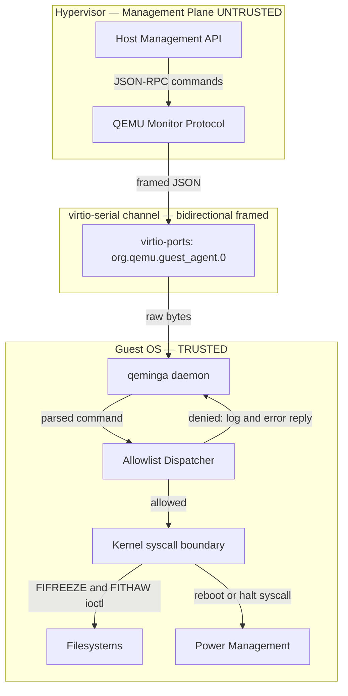
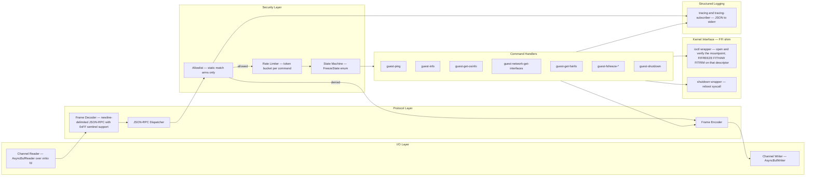
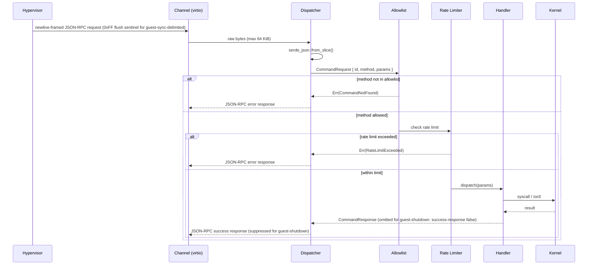

# qeminga — Design Document

## Minimum Secure Subset of QEMU Guest Agent in Rust

**Status:** Draft  
**Last updated:** 2026-08-17

---

## 1. Background and Motivation

The upstream QEMU Guest Agent (`qemu-ga`) is a C daemon that runs inside a virtual machine and exposes a rich command set to the hypervisor via a `virtio-serial` or `isa-serial` channel. While powerful, this broad command surface creates a significant attack vector: a compromised hypervisor layer, a rogue management plane, or a misconfigured orchestration system can instruct the guest agent to execute arbitrary shell commands, write arbitrary files, or manipulate running processes.

**qeminga** replaces `qemu-ga` with a Rust daemon that exposes only the commands required for safe VM lifecycle management, and refuses or ignores every command that could allow the host to gain privileged control of the guest operating system.

### 1.1 Goals

| # | Goal |
|---|------|
| G1 | Support graceful reboot and power-off initiated by the hypervisor. |
| G2 | Support filesystem freeze/thaw (`guest-fsfreeze-freeze` / `guest-fsfreeze-thaw`) so hypervisor-initiated snapshots are crash-consistent. |
| G3 | Report guest information (OS version, file-system state, agent version) so the hypervisor can make informed decisions. |
| G4 | Support host-requested, read-only network interface enumeration (used during cloud-init / IP reporting). |
| G5 | Refuse **all** commands that execute arbitrary code, write arbitrary files, or modify guest users/passwords. |
| G6 | Operate with the minimum OS privileges required (non-root where possible, capability-dropped where root is unavoidable). |
| G7 | Be auditable: command disposition is recorded. During a filesystem-freeze window, records are deferred in a bounded in-memory buffer and may be dropped on overflow; the loss is reported after thaw. |
| G8 | Written in safe Rust; `unsafe` blocks are forbidden except in a single, explicitly reviewed kernel module for syscall-level operations. |

### 1.2 Non-Goals

- Full `qemu-ga` protocol compatibility (only a strict subset is implemented).
- Guest-initiated communication toward the hypervisor beyond heartbeat/info replies.
- Dynamic plugin loading or scripting hooks.

---

## 2. Threat Model

### 2.1 Trust Boundaries



The hypervisor is treated as **untrusted input**. Every byte arriving from the virtio-serial channel is adversarial data from qeminga's perspective.

### 2.2 Attacker Capabilities

| Capability | In scope? |
|---|---|
| Hypervisor sends malformed / oversized JSON | ✅ Yes |
| Hypervisor sends a valid but disallowed command | ✅ Yes |
| Hypervisor replays or floods commands | ✅ Yes |
| Hypervisor sends a valid allowed command at the wrong lifecycle phase | ✅ Yes |
| Local guest process injects into the virtio channel | ❌ Out of scope (single-open device; access controlled by the `0600 qeminga:qeminga` udev rule in §8) |
| Physical memory access by the hypervisor | ❌ Out of scope (hardware / trusted-execution domain) |

### 2.3 Denied Command Categories

The following upstream `qemu-ga` command families are **explicitly denied** by design:

| Category | Examples | Reason for denial |
|---|---|---|
| Arbitrary execution | `guest-exec`, `guest-exec-status` | Direct code execution on guest |
| File I/O | `guest-file-open`, `guest-file-read`, `guest-file-write`, `guest-file-close`, `guest-file-seek`, `guest-file-flush` | Read/write of arbitrary guest files |
| User management | `guest-set-user-password` | Credential manipulation |
| SSH key injection | `guest-ssh-add-authorized-keys`, `guest-ssh-remove-authorized-keys`, `guest-ssh-get-authorized-keys` | Persistent backdoor creation |
| Time synchronization | `guest-set-time` | Can disrupt security protocols (TLS, Kerberos) |
| CPU and memory mutation | `guest-set-vcpus`, `guest-set-memory-blocks` | Host-driven changes to the running guest's CPU or memory topology |
| Disk and hybrid suspend | `guest-suspend-disk`, `guest-suspend-hybrid` | Can leave the guest unavailable or alter its persisted power state |
| Read-only information commands denied in this release | `guest-get-users`, `guest-get-host-name`, `guest-get-time`, `guest-get-timezone`, `guest-get-devices`, `guest-get-disks`, `guest-get-diskstats`, `guest-get-cpustats`, `guest-get-load`, `guest-get-vcpus`, `guest-get-memory-blocks`, `guest-get-memory-block-info`, `guest-network-get-route` | Not required for snapshot or lifecycle operations; each expands the read surface exposed to the host, including the guest routing topology |

`guest-set-timezone` is not an upstream `qemu-ga` command and therefore needs no deny rule.

---

## 3. Allowed Command Set

Only the commands in the following table are implemented. All other commands receive a `{"error": {"class": "CommandNotFound", "desc": "..."}}` response.

| Command | Direction | Description |
|---|---|---|
| `guest-ping` | host → guest | Liveness check; replies `{}` |
| `guest-info` | host → guest | Returns agent version and a QAPI-compatible capability list (§3.1) |
| `guest-sync` | host → guest | Synchronises the request ID for in-flight message tracking |
| `guest-sync-delimited` | host → guest | Echo back the sync ID; prepend a `0xFF` sentinel byte to the response (and expect one in the request) so clients can flush stale partial JSON from a previous connection |
| `guest-get-osinfo` | host → guest | Returns OS name, kernel release, kernel version, machine architecture, and `/etc/os-release` fields `ID`, `NAME`, `PRETTY_NAME`, `VERSION`, `VERSION_ID`, `VARIANT`, `VARIANT_ID` (read-only; **does not** return `/etc/machine-id`) |
| `guest-network-get-interfaces` | host → guest | Returns interface names, hardware addresses, and unicast IP addresses (read-only); loopback and link-local addresses are filtered out to limit host visibility into overlay and management networks |
| `guest-get-fsinfo` | host → guest | Returns mounted filesystem metadata (name, type, mountpoint, total/free bytes) |
| `guest-fsfreeze-status` | host → guest | Returns `"thawed"` or `"frozen"` |
| `guest-fsfreeze-freeze` | host → guest | Calls `FIFREEZE` only on discovered freezable local filesystem superblocks; pseudo, network, and duplicate bind mounts are excluded; returns count of frozen FSes |
| `guest-fsfreeze-freeze-list` | host → guest | As above, restricted to a specified subset of discovered freezable local mountpoints |
| `guest-fsfreeze-thaw` | host → guest | Drains `FITHAW` calls on all discovered freezable local filesystems; returns count of thawed FSes |
| `guest-fstrim` | host → guest | Calls `FITRIM` ioctl to discard unused blocks (storage efficiency) |
| `guest-shutdown` | host → guest | Initiates a clean shutdown. Accepts optional `mode` ∈ `{"halt", "powerdown", "reboot"}` (default `"powerdown"`). **Does not send a success reply** (`success-response: false` upstream); errors are still reported. Clients watch for VM exit. |
| `guest-suspend-ram` | host → guest | Suspends guest to RAM (S3) — **opt-in, disabled by default** via `[features] suspend_ram = false` in `config.toml` |

### 3.1 `guest-info` Capability Contract

`guest-info` uses the upstream-compatible `GuestAgentInfo` shape: a build version and a `supported_commands` array (the member name deliberately uses an underscore). Each `GuestAgentCommandInfo` entry contains `name`, `enabled`, and `success-response`.

Every command in §3 appears exactly once. `guest-suspend-ram` remains listed with `"enabled": false` when its Cargo feature is absent or its runtime setting is off; `guest-fstrim` similarly remains listed when disabled at runtime. The remaining implemented commands report `"enabled": true` in normal operation. A temporary `Frozen` state does not change these advertised capabilities; it is enforced by the lifecycle gate in §5.3.

`guest-shutdown` is the sole listed command with `"success-response": false`; every other listed command has `"success-response": true`. Denied commands do not appear in `supported_commands`.

---

## 4. Architecture

### 4.1 Component Overview



### 4.2 State Machine — Freeze State

fsfreeze operations must be serialised. qeminga tracks freeze state explicitly:

```mermaid
stateDiagram-v2
    [*] --> Thawed : no recovery marker
    [*] --> Frozen : recovery marker present

    Thawed --> Freezing : guest-fsfreeze-freeze received
    Freezing --> Frozen : eligible filesystems processed without hard error
    Freezing --> Thawed : hard error, auto-rollback completes

    Frozen --> Thawing : guest-fsfreeze-thaw received
    Frozen --> Thawing : watchdog deadline reached
    Thawed --> Thawing : guest-fsfreeze-thaw recovery drain
    Thawing --> Thawed : FITHAW drain completes; recovery marker removed
    Thawing --> Frozen : unrecoverable thaw failure; retain recovery marker

```



Before a freeze, qeminga builds a mount plan from `/proc/self/mountinfo`. It selects only local, device-backed, freezable filesystems; excludes pseudo and network mounts; and de-duplicates bind mounts by filesystem identity. `guest-fsfreeze-freeze-list` is intersected with this plan. This avoids attempting to freeze mounts that can hang or are never expected to implement `FIFREEZE`.

Mount order is load-bearing: the freeze plan is traversed in reverse mount order so nested mounts are frozen deepest-first; thaw traverses it forward. Before the first `FIFREEZE`, qeminga switches audit output to the freeze-safe ring and creates the recovery marker described in §4.4. If marker creation fails, it performs no freeze ioctl.

A pathname names whatever is mounted there *now*, not the superblock the plan recorded: a mount placed over a planned mountpoint after the plan was built would hide it. Every ioctl therefore goes through a descriptor that the kernel shim opened on one of the target's mountpoints and verified with `fstat(2)` against the planned `(major, minor)`; a mismatch is not the filesystem's answer and is never treated as one. The plan keeps every mountpoint of a superblock (the first names it, the others are its aliases) so a hidden first pathname is retried through an alias, and the descriptors a freeze opened are held until their drain completes, so a thaw in the same process reaches the filesystem that was frozen whatever its pathnames lead to by then. After a restart no descriptor survives: recovery goes by the pathnames and their aliases, and a planned superblock that none of them opens on is reported as unreachable with the recovery state retained, never as thawed.

**Errno handling during freeze:**
- `EOPNOTSUPP` — the filesystem does not implement freeze (e.g. tmpfs, proc). Counted as skipped, not as frozen.
- `EBUSY` — the superblock is already frozen. This is non-fatal (for example, a concurrent freezer may hold it) and does **not** increment the freeze result: only successful `FIFREEZE` calls count as frozen by qeminga. It is retained in the thaw plan by deliberate compatibility policy. Because nesting depth is unknowable during recovery, qeminga drains all planned filesystems; a concurrent in-guest freezer is therefore unsupported and may have its freeze released by qeminga's later thaw.
- Any other errno, or a target none of whose mountpoints opens on its planned superblock — treated as a hard error. All previously processed filesystems are thawed immediately in forward order through the descriptors the freeze opened; the recovery marker remains until the drain completes.

Thaw is not idempotent at the kernel level. Multiple successful `FIFREEZE` calls can require multiple `FITHAW` calls, and a prior agent or another freezer can hold an unknown nesting depth. For each eligible mountpoint, including an `EBUSY` entry retained above, qeminga issues `FITHAW` until it returns an error, counting a filesystem at most once when at least one call succeeds. A drain is complete only when that error is the ioctl's own answer and a documented end: `EINVAL` (the filesystem is not frozen) or `EOPNOTSUPP` (it cannot freeze at all). Any other outcome leaves the target possibly frozen, because Linux keeps a filesystem frozen when its unfreeze fails, and an error from before the ioctl (a mountpoint that cannot be opened, or one that opens on another superblock) means no `FITHAW` was issued at all, whatever its errno: the remaining targets are still drained, then the failure is reported as unrecoverable, with the recovery marker and the frozen gate retained (`Thawing → Frozen`, and the same rule for the rollback of a failed freeze). A thaw received while qeminga believes it is `Thawed` still performs this recovery drain rather than returning a no-op. Discovering the targets and draining them are separate steps: the descriptors this process holds from its freeze are drained, and released, even when the mount table cannot be read (`EMFILE`, which those very descriptors may have caused, is the typical case), so a thaw always does the recovery work it already has the means for; the read failure is then reported as unrecoverable with the marker retained, because filesystems frozen by an earlier instance could not be discovered, and the next attempt completes the recovery.

### 4.3 Request Lifecycle



### 4.4 Freeze Watchdog and Crash Recovery

A per-freeze watchdog runs as a cancellable async task. It ensures that a hypervisor crash or a network partition mid-snapshot does not leave the guest permanently frozen.

**Arming:** the watchdog is armed when the state transitions to `Frozen`. Its deadline is `now + fsfreeze_idle_timeout_secs`.

**Refreshing:** any `guest-fsfreeze-status` request received while `Frozen` resets the deadline to `now + fsfreeze_idle_timeout_secs`. This lets a live backup orchestrator hold the freeze open by polling, while a dead one loses it.

**Hard cap:** the deadline is capped at `arm_time + fsfreeze_max_timeout_secs` regardless of status heartbeats. A legitimately long backup that exceeds `fsfreeze_max_timeout_secs` will be auto-thawed; this is preferable to hanging indefinitely.

**Cancellation and races:** the watchdog waits with `tokio::select!` on its deadline, a refreshed deadline signal, and a cancellation signal. A normal thaw atomically claims the `Thawing` transition and signals cancellation; if the deadline wins, the watchdog claims that transition instead. `spawn_blocking` handles are never treated as cancellable.

**Blocking requirement:** only the `FIFREEZE` and `FITHAW` ioctls run through `spawn_blocking`; the timer, refresh, cancellation, and state transition remain on the async runtime. The watchdog hands its thaw drain to `spawn_blocking` only after it wins the state transition.

**Scope of the bound:** the watchdog bounds the time spent in `Frozen`, from the moment the freeze walk has completed, and it is re-armed on every entry into that state (after a failed thaw included). It does not bound the freeze or thaw walks themselves: `FIFREEZE` waits for the filesystem's writers and performs its own sync, the call cannot be interrupted, and abandoning its `spawn_blocking` handle would let a late completion freeze another target after the caller had given up. A walk blocked in `FIFREEZE` on one target therefore leaves the targets frozen earlier in that walk without an autonomous release until the call returns; the restart recovery through the marker still covers the case, and the service manager's stop timeout bounds the process. Bounding that window would need the coordinator to publish each completed target while the walk is still under way, to enforce an operation deadline independently of the blocked call, and to absorb a late success without publishing a stale `Frozen`; that is a design change (OQ-8), not a variation of the timer.

**Recovery marker:** `state_path` is an atomically-created marker on an unfreezable runtime filesystem (default `/run/qeminga/frozen`). The service manager provisions `/run/qeminga` before startup (§8.4). qeminga opens that directory once at startup, resolving the configured path as the kernel does, checks the device it is on against the freeze plan (§8.2), and keeps the descriptor: the marker is created with `openat(dirfd, ..., O_CREAT|O_EXCL)`, `fsync`ed before the first `FIFREEZE`, and removed with `unlinkat(dirfd, ...)` only after a complete thaw drain, so a later change to the pathname (a symlink, a rename, a mount placed over it) cannot redirect a marker operation to another filesystem. A startup that finds the marker enters `Frozen` recovery mode, defers normal log and pid-file creation, keeps using the in-memory audit buffer, and accepts only the frozen-safe command set until thaw succeeds. A reboot clears the default `/run` marker and resets the kernel freeze state together; an external thaw can still leave a stale marker, which qeminga treats pessimistically because an unnecessary thaw is safer than proceeding while a filesystem might be frozen. This also recovers from `SIGKILL`, a seccomp kill, or a panic during freeze.

---

## 5. Security Design Decisions

### 5.1 Static Allowlist via Match Arms

The dispatcher uses a `match` expression on the method string. There is **no dynamic dispatch table**, no plugin loader, and no way to register new handlers at runtime. Adding a command requires a source-code change, a code review, and a new release.

```rust
// Sketch — see src/dispatch.rs for full implementation
match req.method.as_str() {
    "guest-ping"              => handlers::ping(req),
    "guest-info"              => handlers::info(req),
    "guest-sync"              => handlers::sync(req),
    "guest-sync-delimited"    => handlers::sync_delimited(req),
    "guest-get-osinfo"        => handlers::get_osinfo(req),
    "guest-network-get-interfaces" => handlers::get_interfaces(req),
    "guest-get-fsinfo"        => handlers::get_fsinfo(req),
    "guest-fsfreeze-status"   => handlers::fsfreeze_status(req),
    "guest-fsfreeze-freeze"   => handlers::fsfreeze_freeze(req),
    "guest-fsfreeze-freeze-list" => handlers::fsfreeze_freeze_list(req),
    "guest-fsfreeze-thaw"     => handlers::fsfreeze_thaw(req),
    "guest-fstrim" if config.fstrim_enabled() => handlers::fstrim(req),
    "guest-shutdown"          => handlers::shutdown(req),
    "guest-suspend-ram" if config.suspend_ram_enabled() => handlers::suspend_ram(req),
    _                         => Err(Error::CommandNotFound(req.method)),
}
```

### 5.2 Input Size Limits and Resynchronisation

The frame decoder enforces three hard limits before handing data to the JSON parser:

1. **Frame length:** 65,536 bytes maximum per JSON-RPC message. An oversized frame is not silently dropped — the decoder enters a **discard-until-newline** state, consuming and discarding bytes until the next `\n` frame delimiter is found before resuming normal operation. This prevents the tail of an oversized blob from being parsed as the next command. The `0xFF` sentinel byte in a `guest-sync-delimited` request also forces an exit from the discard state.

2. **JSON nesting depth:** `serde_json` is configured with a maximum nesting depth of **32 levels**. Deeply nested objects are a common amplification vector for recursive-descent parsers.

3. **String field length:** individual JSON string values are capped at **4,096 bytes** via a custom deserialiser visitor, preventing memory exhaustion from a single oversized string that stays within the overall frame limit.

Before an audit record is created, the attacker-controlled method name is projected to at most 64 UTF-8 bytes at a character boundary. Longer names record that prefix, the original byte length, and a fixed-size digest instead of the full value. Audit fields are always JSON-serialised strings, never interpolated into a log format string.

### 5.3 Rate Limiting

Each command class has a per-minute quota enforced by a token-bucket limiter:

| Command class | Quota | Notes |
|---|---|---|
| `guest-ping`, `guest-sync*` | 120 / min | |
| `guest-get-*`, `guest-network-get-interfaces` | 30 / min | |
| `guest-fsfreeze-freeze`, `guest-fsfreeze-freeze-list` | 10 / min | Freeze is rate-limited |
| `guest-fsfreeze-status`, `guest-fsfreeze-thaw` | **unlimited** | **Thaw is never rate-limited.** A frozen filesystem must always be thaw-able; denying a thaw would make the agent's own DoS control the DoS. |
| `guest-fstrim` | 5 / min | |
| `guest-shutdown`, `guest-suspend-ram` | 2 / min | Decorative — a host that can call shutdown can also cut power; rate limit is a last-resort circuit-breaker, not a meaningful defence. |

**While the agent is in `Frozen` state**, only the frozen-safe command set is accepted regardless of rate-limiter state: `guest-fsfreeze-status`, `guest-fsfreeze-thaw`, `guest-ping`, `guest-sync`, `guest-sync-delimited`, and `guest-info`. All other commands are rejected with `{"error": {"class": "GenericError", "desc": "filesystems are frozen; retry after thaw"}}` until the filesystems are thawed. `GenericError` is a valid QAPI error class and accurately states that the command is known but unsafe in the current lifecycle state; qeminga intentionally does not rely on upstream's implementation detail of reporting these commands as absent.

### 5.4 Capability Dropping (Linux)

qeminga starts with the privilege needed to open the channel, then runs as the dedicated `qeminga` system user (UID/GID 600 by convention). Linux clears the effective capability set on a UID transition, so the order is part of the security design:

1. Open the channel and perform other pre-drop setup.
2. Set `PR_SET_KEEPCAPS`.
3. Call `setresgid()` and `setresuid()` for the `qeminga` account.
4. Re-raise the final capabilities and the temporary `CAP_SETPCAP` needed to trim the bounding set.
5. Drop every non-final capability from the bounding set, including `CAP_SETPCAP`, then clear all non-final effective, permitted, inheritable, and ambient capabilities.
6. Set `PR_SET_NO_NEW_PRIVS`, then install seccomp.

The final effective and permitted sets contain exactly:

| Capability | Required for |
|---|---|
| `CAP_SYS_ADMIN` | `FIFREEZE`, `FITHAW`, and `FITRIM` ioctls; it must be held in the initial user namespace |
| `CAP_SYS_BOOT` | `reboot(2)` syscall |
| `CAP_DAC_READ_SEARCH` | Opening protected mountpoint directories for freeze/thaw |

`CAP_DAC_READ_SEARCH` is intentionally retained: `FIFREEZE` requires an fd opened on the mountpoint, and UID 600 would otherwise receive `EACCES` on a mode-0700 mountpoint and roll back the entire freeze. qeminga does not support running this path solely in a non-initial user namespace; startup fails rather than claiming freeze support that the kernel will reject.

> **Important:** `CAP_SYS_ADMIN` is close to retaining root. It covers `mount`, `pivot_root`, `setns`, `bpf` on older kernels, and ioctls across a wide range of kernel subsystems. Running as UID 600 is defence in depth, but G6's "non-root where possible" should not be read as meaningful privilege reduction while `CAP_SYS_ADMIN` is held. The effective narrowing boundary is the seccomp filter (§5.5), not the capability drop.

### 5.5 Seccomp Filter (optional, recommended)

When the `seccomp` Cargo feature is compiled in **and** `[features] seccomp = true` is set in `config.toml`, qeminga installs a `SECCOMP_MODE_FILTER` policy at startup.

The policy is generated as a separate, target-specific profile for `x86_64-unknown-linux-gnu` and `aarch64-unknown-linux-gnu`; it is not one hand-maintained list of syscall spellings. Shared logical operations resolve to syscall numbers valid on the target. In particular, portable profiles use `openat`, `newfstatat`/`statx`, `ppoll`, and `epoll_pwait`; x86-64-only legacy aliases such as `open`, `stat`, `lstat`, `poll`, and `epoll_wait` are included only in the x86-64 profile when an observed runtime need requires them.

Each profile covers both the multi-threaded tokio runtime and the agent's allowed commands:

| Surface | Required operations |
|---|---|
| File, metadata, and channel I/O | `read`, `write`, `readv`, `writev`, `close`, `openat`, `fcntl`, `ioctl`, `lseek`, `pread64`, `pwrite64`, `newfstatat`, `statx`, `statfs`, `fstatfs`, `getdents64` |
| Recovery marker | `openat` with `O_CREAT|O_EXCL`, `fsync`, and `unlinkat`; systemd creates the parent directory, so qeminga does not need `mkdirat` |
| Runtime and reactor | Memory management; `clone`/`clone3`; robust-list, thread-ID, `rseq`, futex, scheduling, and `prlimit64` support; epoll, eventfd, and portable polling operations; signals, clocks, identity queries, and randomness |
| OS and network information | `uname` for `guest-get-osinfo`; `socket`, `bind`, `sendto`/`sendmsg`, `recvmsg`, and `getsockname` for the netlink exchange used by `guest-network-get-interfaces` |
| Privileged handlers | `reboot`; `ioctl` restricted by request number to `FIFREEZE`, `FITHAW`, and `FITRIM` |

The production default action kills the process for an unlisted syscall. Compatibility builds first exercise the same profile with a logging action, then the enforced profile runs the complete command matrix in CI on both supported architectures and on every dependency update. The filter is installed after capability dropping and `PR_SET_NO_NEW_PRIVS`, so its installation syscall does not need to remain available afterward.

### 5.6 No `unsafe` Outside the Kernel Shim

The `kernel` module is the single location permitted to use `unsafe`. Every non-kernel module carries `#![forbid(unsafe_code)]`; CI rejects any exception outside `src/kernel/`. The kernel module is gated behind `#[cfg(target_os = "linux")]`, narrowly reviewed, and exposes only safe wrappers returning `Result<T, KernelError>`.

### 5.7 Process Failure and Channel Recovery

Release builds use `panic = "abort"` and rely on the service manager to restart the process. A panic or seccomp kill never attempts a best-effort write or thaw from an indeterminate state; the pre-freeze marker forces the restarted process into the conservative recovery path in §4.4. A graceful stop requested while frozen is deferred until thaw only when the unit's `TimeoutStopSec` exceeds `fsfreeze_max_timeout_secs` plus a thaw-drain margin (§8.4); otherwise it intentionally degrades to the forced-stop recovery path. A forced stop leaves the marker in place.

Channel EOF or HUP closes both channel handles, discards any partial frame, and retries opening the configured channel with bounded backoff. Reconnection never resets `FreezeState`, cancels a watchdog, clears the recovery marker, or enables the normal audit sink while frozen. A newly connected peer starts with a clean decoder and should use `guest-sync-delimited` to establish stream synchronisation.

### 5.8 Supply-Chain Controls

`Cargo.lock` is committed and release/CI builds use `--locked`. CI runs `cargo deny` for advisory, license, source, and duplicate-dependency policy, and runs `cargo audit` both on pull requests and on a scheduled job because advisories can arrive without a source change. A dependency update also triggers the enforced seccomp command-matrix test described in §5.5.

---

## 6. Module Structure

```
qeminga/
├── Cargo.toml
├── Cargo.lock               # committed; release and CI builds use --locked
├── docs/
│   └── design.md          ← this file
└── src/
    ├── main.rs            # entry point: parse config, drop caps, start async runtime
    ├── config.rs          # configuration schema, channel, recovery marker, and limits
    ├── channel.rs         # open, read/write, EOF/HUP recovery for virtio-serial fd
    ├── framing.rs         # newline-delimited frame decoder/encoder; 0xFF sentinel handling
    ├── audit.rs           # structured sink and byte-bounded freeze-safe ring
    ├── proto.rs           # JSON-RPC types (Request, Response, Error)
    ├── dispatch.rs        # static allowlist match + rate limiter
    ├── state.rs           # FreezeState enum + Mutex-guarded singleton
    ├── watchdog.rs        # cancellable async timer and blocking thaw handoff
    ├── seccomp.rs         # target-specific seccomp policy construction
    ├── handlers/
    │   ├── mod.rs
    │   ├── ping.rs
    │   ├── info.rs
    │   ├── osinfo.rs
    │   ├── interfaces.rs  # guest-network-get-interfaces
    │   ├── fsinfo.rs
    │   ├── fsfreeze.rs    # freeze, freeze-list, thaw, status, fstrim
    │   ├── suspend.rs     # opt-in guest-suspend-ram
    │   └── shutdown.rs
    └── kernel/
        ├── mod.rs         # safe wrappers, re-exports
        ├── ioctl.rs       # unsafe: FIFREEZE/FITHAW/FITRIM via nix
        ├── shutdown.rs    # unsafe: reboot(2) via nix
        └── caps.rs        # capability dropping via caps crate
```

---

## 7. Key Dependencies

| Crate | Version | Purpose |
|---|---|---|
| `tokio` | 1.x | Async runtime — **multi-threaded** (`tokio::main` with `flavor = "multi_thread"`, min 2 worker threads). It hosts the cancellable watchdog and keeps the reactor alive while `FIFREEZE`, `FITHAW`, and `FITRIM` run on `spawn_blocking`. |
| `serde` / `serde_json` | 1.x | JSON serialisation |
| `nix` | 0.27.x | Safe-ish wrappers for Linux syscalls and ioctls |
| `caps` | 0.5.x | Linux capability dropping |
| `tracing` | 0.1.x | Structured logging |
| `tracing-subscriber` | 0.3.x | Log formatting (JSON output) |
| `thiserror` | 1.x | Error type derivation |
| `governor` | 0.6.x | Token-bucket rate limiter |
| `seccompiler` | 0.4.x | Target-specific seccomp BPF filter (optional feature) |

---

## 8. Configuration

### 8.1 Cargo Features vs. Runtime Config

There are two independent switches for optional behaviour:

| Layer | Mechanism | Effect |
|---|---|---|
| **Compile-time** | `cargo build --features <name>` | Includes the code in the binary. A binary without a feature cannot enable it at runtime. |
| **Runtime** | `[features]` in `config.toml` | Enables the compiled-in code. Setting a key whose feature was not compiled in is a warning, not an error. |

The `seccomp` feature and `suspend_ram` feature both follow this two-level pattern. `fstrim` is always compiled in (no Cargo feature gate) but can be disabled at runtime.

### 8.2 Configuration File

qeminga reads a TOML configuration file (default: `/etc/qeminga/config.toml`):

```toml
[agent]
config_version          = 1        # config schema; not the guest-info agent version
channel_path            = "/dev/virtio-ports/org.qemu.guest_agent.0"
log_level               = "info"   # trace | debug | info | warn | error
state_path              = "/run/qeminga/frozen"
fsfreeze_idle_timeout_secs = 30    # auto-thaw if no guest-fsfreeze-status heartbeat received
fsfreeze_max_timeout_secs  = 300   # hard cap; thaw even if heartbeats are arriving

[rate_limits]
ping_sync_per_min          = 120
get_commands_per_min       = 30
fsfreeze_freeze_per_min    = 10
fstrim_per_min             = 5
shutdown_per_min           = 2

[features]
# Runtime half of the two-level feature flag (compile-time half: --features)
suspend_ram = false   # opt-in: can disrupt security monitoring
fstrim      = true    # opt-out: discard unused blocks
seccomp     = true    # no effect if binary not compiled with --features seccomp
```

`config_version` versions the configuration schema. The agent version returned by `guest-info` is build metadata and cannot be supplied by a runtime configuration file. `state_path` must be on an unfreezable runtime filesystem: startup opens the marker's directory (following `..` components and symlinks as the kernel does) and rejects it when the filesystem that directory is on is in the freeze plan; the pathname's prefix alone is never what is judged.

### 8.3 Device Node Permissions

The virtio-serial channel is a **single-open device**: only one process can hold it at a time. This is the primary OS-level isolation between the agent and any other local process. The following udev rule must be installed (e.g. `/etc/udev/rules.d/99-qeminga.rules`):

```
SUBSYSTEM=="virtio-ports", ATTR{name}=="org.qemu.guest_agent.0", \
    OWNER="qeminga", GROUP="qeminga", MODE="0600"
```

The agent runs as UID 600 (§5.4) and cannot open the port under its default `root:root` `0600` ownership; this rule transfers ownership to the dedicated `qeminga` account. The residual exposure is that a process running as `qeminga` or as root can still open the channel and speak directly to QEMU. The `qeminga` account therefore has no login shell and is used only by the service. This rule protects against unprivileged co-tenants, not a root process.

### 8.4 Packaging and Service Conflict

qeminga and `qemu-guest-agent` must never run together: both contend for the single-open channel and can race responses even if both start successfully. A distribution package declares a package conflict where supported, and the qeminga system unit uses `Conflicts=qemu-guest-agent.service` plus explicit ordering after that unit. Installation stops and disables the upstream service before enabling qeminga; a migration does not share or multiplex the existing channel.

The shipped systemd unit also binds to and starts after the specific virtio-port device, starts before ordinary multi-user workloads, and creates `/run/qeminga` through `RuntimeDirectory=qeminga` with ownership provisioned for the `qeminga` account. This lets the recovery marker use `openat(..., O_CREAT|O_EXCL)` without a runtime `mkdirat`. For the default `fsfreeze_max_timeout_secs = 300`, it sets `TimeoutStopSec=330s`; any change to the hard cap must keep `TimeoutStopSec` greater than that cap plus a thaw-drain margin, or service-stop deferral deliberately falls back to marker recovery (§5.7).

At startup, an `EBUSY` opening the channel is a terminal, explicit `channel_already_open` error, not an in-process retry. This makes a boot-time single-open race with a leftover agent, debugger, or local process visible to the operator instead of presenting as a healthy but unreachable agent.

### 8.5 Supported Platform Matrix

| Dimension | Supported baseline |
|---|---|
| Operating system | Linux only |
| Architectures | `x86_64-unknown-linux-gnu` and `aarch64-unknown-linux-gnu`, each with its own seccomp profile and CI coverage |
| Kernel | Linux 5.4 or newer with seccomp-BPF and the requested filesystem ioctls available |
| Execution context | A systemd-managed VM in the initial user namespace; unprivileged containers are unsupported for freeze/trim |
| Runtime state | systemd creates `/run/qeminga` for the recovery marker before the daemon starts; qeminga never creates this directory after seccomp is installed |
| Freeze coverage | ext4 and XFS are required interoperability targets; other local filesystems are eligible only when their `FIFREEZE` behavior is tested |
| Excluded mounts | Pseudo and network filesystems; duplicate bind mounts are de-duplicated by filesystem identity |

---

## 9. Audit Log Format

Outside a freeze window, every received command is written as a structured JSON line to `stderr`, captured by the service manager (e.g., `systemd`):

```json
{
  "timestamp": "2026-08-16T20:00:00.000Z",
  "level": "INFO",
  "event": "command_received",
  "method": "guest-fsfreeze-freeze",
  "id": 42,
  "disposition": "allowed",
  "freeze_state_before": "thawed"
}
```

Denied commands use `"disposition": "denied"` and include `"reason"`.

The `id` field preserves the protocol's signed 64-bit integer; `42` is only an illustrative value. For a method longer than 64 UTF-8 bytes, the record uses `method_prefix`, `method_len_bytes`, and `method_digest` instead of the raw `method`.

### 9.1 Logging During Freeze — Hazard and Mitigation

**G7 (auditability) and G2 (fsfreeze) are in direct conflict.** After `FIFREEZE`, writes to a frozen superblock block indefinitely in `D` state:

- journald captures `stderr` → writes to `/var/log/journal` (on a frozen filesystem) → journald blocks → its socket buffer fills → the agent's next `tracing` write blocks → the agent can no longer read from the virtio channel → `guest-fsfreeze-thaw` is never received → the guest is permanently frozen. The watchdog task is in the same process and shares the same blocked write path.

**Mitigation:** entering `Freezing` synchronously swaps the normal sink for a **64 KiB byte-bounded in-memory ring buffer** before the recovery marker is written. Log records are written to this buffer without I/O; the bounded method projection in §5.2 prevents one field from defeating the byte limit. No descriptor that might reach a frozen filesystem is written until the state is `Thawed`.

While frozen, records accumulate in the ring. On overflow, the oldest records are discarded and a loss counter is retained. The thaw transition explicitly triggers a flush to the normal sink, beginning with the loss count if nonzero; a background flusher may continue draining only while `Thawed`. Recovery-marker startup follows the same rule and delays normal log and pid-file creation until thaw. Reads from the already-open virtio channel remain safe, which is why the frozen-safe command set can still receive a thaw request.

---

## 10. Decisions

| # | Decision |
|---|---|
| D1 | `guest-suspend-ram` is **opt-in**: disabled by default. Enable via `[features] suspend_ram = true` in `config.toml`. |
| D2 | `guest-fstrim` is **included**: enabled by default; can be disabled via `[features] fstrim = false` in `config.toml`. |
| D3 | The threat model for the configuration file is **out of scope**: if the host can overwrite `/etc/qeminga/config.toml` it can replace the agent binary entirely. OS-level file permissions are the appropriate control. |
| D4 | A freeze watchdog is **required** and is fully specified in §4.4. The idle timeout defaults to 30 seconds and the hard cap to 300 seconds; both are configurable in `config.toml`. |
| D5 | A pre-freeze recovery marker is mandatory. It is created before any `FIFREEZE`, retained through failures, and forces a conservative frozen-only recovery mode after an unexpected process exit. |
| D6 | qeminga supports Linux 5.4+ on x86-64 and arm64 in the initial user namespace. Seccomp policies and CI are architecture-specific. |
| D7 | `CAP_DAC_READ_SEARCH` is retained with `CAP_SYS_ADMIN` and `CAP_SYS_BOOT` so a protected local mountpoint cannot silently make the entire snapshot path fail. |

---

## 11. Improvements Over Upstream `qemu-ga` Beyond Rust

qeminga is a deliberately constrained replacement for the general-purpose upstream agent, not a feature-for-feature successor. The following are design and implementation improvements independent of the choice of programming language; they describe qeminga's security and operational contract rather than claiming that every upstream deployment lacks equivalent local hardening.

| Area | qeminga improvement | Operational effect |
|---|---|---|
| Command exposure | A source-reviewed, default-deny command subset replaces the broad, configurable general-purpose RPC surface. Denied execution, file-I/O, credential, and topology-mutation commands cannot be enabled by runtime configuration. | Reduces the host-to-guest control surface to lifecycle and snapshot operations. |
| Host-input containment | Fixed frame, nesting, string, and audit-field bounds are paired with deterministic newline and `0xFF` resynchronisation. | Malformed or oversized channel input cannot permanently desynchronise the protocol or grow audit work without bound. |
| Privilege containment | Dedicated-account execution, a bounded capability set, `PR_SET_NO_NEW_PRIVS`, and target-specific seccomp policies are normative and verified with an installed-filter command matrix. | Limits the damage of a parser or handler defect after the channel is opened. |
| Freeze liveness and recovery | An idle-plus-hard-cap watchdog bounds abandoned snapshots (upstream Linux has no freeze timeout); a pre-freeze marker on an unfreezable, startup-validated path drives conservative restart recovery. | Avoids indefinite freezes after a host failure, and guarantees the recovery marker itself can never block on a frozen filesystem. |
| Freeze-window auditability | A byte-bounded in-memory audit ring defers sink I/O, records loss on overflow, and flushes after thaw. | Preserves useful audit evidence without allowing journald or another frozen filesystem to deadlock the thaw path. |
| Deployment guardrails | Single-open startup failures are explicit, the upstream service is conflicted, and systemd creates the marker directory and couples stop timing to the freeze bound. | Turns common migration and boot-time availability failures into observable configuration errors. |

---

## 12. Acceptance Criteria

| ID | Criterion |
|---|---|
| AC1 | `guest-exec` and all other denied commands return `{"error": {"class": "CommandNotFound", ...}}`. |
| AC2 | `guest-fsfreeze-freeze` followed by `guest-fsfreeze-thaw` succeeds on a real Linux ext4 or xfs filesystem. |
| AC3 | After the UID transition, the effective and permitted sets contain exactly `CAP_SYS_ADMIN`, `CAP_SYS_BOOT`, and `CAP_DAC_READ_SEARCH`; no other capability can be regained from the bounding set. |
| AC4 | An oversized (> 64 KiB) frame is rejected, the decoder re-syncs to the next newline, and the subsequent valid command is handled correctly (no permanent desync). |
| AC5 | A flood of 1000 `guest-ping` requests within one second is rate-limited; the daemon continues serving subsequent valid requests. |
| AC6 | `Cargo.lock` is committed; `cargo audit` and `cargo deny` report zero policy violations in CI and `cargo audit` also runs on a schedule. |
| AC7 | `cargo clippy -- -D warnings` produces zero warnings. |
| AC8 | All unit tests pass under `cargo test`. |
| AC9 | While `Frozen`, every command outside the frozen-safe set is rejected with `GenericError` without touching a filesystem; `guest-fsfreeze-thaw` is accepted regardless of rate-limiter state. |
| AC10 | Freeze → `SIGKILL` the agent → restart: the pre-freeze marker puts the agent in recovery mode, it refuses non-thaw commands, and a subsequent `guest-fsfreeze-thaw` successfully drains and thaws the filesystems. |
| AC11 | Freeze watchdog: if `guest-fsfreeze-status` heartbeats stop for `fsfreeze_idle_timeout_secs`, the filesystems are automatically thawed; if heartbeats continue past `fsfreeze_max_timeout_secs`, the filesystems are thawed regardless. |
| AC12 | `guest-shutdown` does not emit a JSON-RPC success response on the channel; the VM exits cleanly. |
| AC13 | Under sustained logging volume with a filled journald pipe, a freeze/thaw cycle completes without a write to a frozen filesystem; any ring overflow is reported after thaw. |
| AC14 | The frame decoder survives a `cargo fuzz` corpus for at least one hour with no panic, hang, or unbounded allocation, including oversized-frame discard and resynchronisation cases. |
| AC15 | With seccomp **installed**, the full allowed-command matrix passes on x86-64 and arm64 in CI, including a freeze/thaw cycle that creates the marker with `openat(O_CREAT|O_EXCL)`, `fsync`s it, and removes it with `unlinkat`, and after every dependency update. |
| AC16 | Against real libvirt, `virsh domfsfreeze`, `virsh domfsthaw`, `virsh domifaddr --source agent`, and `virsh domshutdown --mode agent` succeed. |
| AC17 | Freeze succeeds with tmpfs and bind mounts present and can open a mode-0700 local mountpoint; unsupported or duplicate mounts do not turn the operation into a hard failure, and an `EBUSY` mount does not inflate qeminga's freeze count. |
| AC18 | Channel EOF/reopen during a freeze preserves the recovery marker and frozen state; after reconnection, a thaw request completes successfully. |
| AC19 | `guest-info` returns `version` and `supported_commands` with `name`, `enabled`, and `success-response`; disabled optional commands remain listed as disabled, `guest-shutdown` reports `success-response: false`, and denied commands are absent. |
