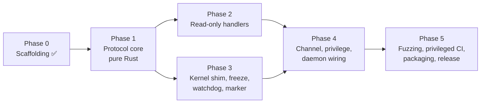

# qeminga — Task List for Coding Agents

This is the executable work queue derived from [`docs/design.md`](design.md),
which is the normative specification. Every task below cites the design
sections it implements and the acceptance criteria (AC) it satisfies.
Read [`AGENTS.md`](../AGENTS.md) for the repository conventions before you
start.

---

## 1. How to use this list

1. **Pick** the lowest-numbered `todo` task whose *Depends on* entries are all
   `done`. Finish a phase before starting the next unless tasks are marked
   parallel-safe (`∥`).
2. **Claim** it: change its **Status** to `in-progress (<branch>)` in a tiny
   commit so other agents can see it. One task per branch, named
   `task/<id>-<slug>` (for example `task/t1.2-frame-decoder`).
3. **Work test-first.** Write the tests listed under *Tests first (red)*,
   run them, watch them fail for the right reason, then write the smallest
   implementation that turns them green, then refactor. Commit at each green
   step.
4. **Finish** by running the full check suite (`AGENTS.md` §Checks) and
   setting **Status** to `done` in the same PR. Reference task and AC ids in
   commit subjects: `T1.2: discard-until-newline on oversized frames (AC4)`.
5. **Do not deviate silently.** If a task cannot be done as written without a
   design change, stop, add an entry under §4 *Open questions*, set the task
   to `blocked (OQ-n)`, and pick another task.

Status values: `todo` · `in-progress (who)` · `blocked (why)` · `done`.

### Task anatomy

| Field | Meaning |
|---|---|
| **Design** | Sections of `design.md` that specify the behaviour. |
| **Depends on** | Tasks that must be `done` first. |
| **Files** | Files the task is expected to create or touch (a listed `foo.rs` may become a directory module `foo/mod.rs` if it grows). |
| **Tests first (red)** | Behaviours to encode as failing tests *before* writing production code. Names are suggestions; the behaviour is the contract. |
| **Implement (green)** | Design-level guidance for the production code. |
| **Done when** | Concrete exit criteria in addition to the standard checks. |

### Test conventions used below

- Unit tests live in `#[cfg(test)] mod tests` next to the code; integration
  tests live in `tests/`; fixtures in `tests/fixtures/<area>/`.
- Anything that touches the kernel (ioctls, capabilities, `reboot`, netlink,
  `/proc`) is reached through a trait (`KernelOps`, `MountSource`,
  `OsInfoSource`, …) with a fake implementation used by tests.
- Tests that need root or capabilities are `#[ignore]`d, named with the
  prefix `privileged_`, and run by the privileged CI job (T5.2) via
  `sudo -E cargo test --features seccomp,suspend_ram,test-fakes -- --ignored --test-threads=1 privileged_` (never `--all-features`, which would add `seccomp-log`).
- Time-dependent async code is tested with `#[tokio::test(start_paused = true)]`
  and `tokio::time::advance`.
- Parsers and decoders get a `proptest` property test in addition to examples.

---

## 2. Phase map

| Phase | Tasks | Needs OS access? | Parallelism |
|---|---|---|---|
| 0 | T0.1–T0.4 | no | done |
| 1 | T1.1–T1.8 | no | T1.2–T1.7 are `∥` once T1.1 is done |
| 2 | T2.1–T2.5 | read-only (`/proc`, `/etc`, netlink) | all `∥` |
| 3 | T3.1–T3.7 | `CAP_SYS_ADMIN` for real ioctls (fakes otherwise) | T3.2/T3.3 `∥` after T3.1 |
| 4 | T4.1–T4.7 | yes | T4.1–T4.5 `∥`, then T4.6, T4.7 |
| 5 | T5.1–T5.6 | CI runners with `sudo` | mostly `∥` |

---

## 3. Clarifications (decisions already taken)

These resolve ambiguities in `design.md` so that parallel agents make the
same choice. Each is small enough not to need a design revision; if you
disagree, raise it as an open question rather than diverging.

| Id | Decision |
|---|---|
| C-1 | **Wire format is QMP/QGA style, not JSON-RPC 2.0.** Requests are `{"execute": "<name>", "arguments": {...}?, "id": <int>?}`; success replies are `{"return": <value>}`; errors are `{"error": {"class": "...", "desc": "..."}}`. The design says "JSON-RPC" loosely; §3's error shape, §3.1's `GuestAgentInfo`, and AC16 (real libvirt) require the QGA format. |
| C-2 | Only QAPI error classes are used: `CommandNotFound` for non-allowlisted **and** runtime-disabled commands (`desc` `"command <name> has been disabled"` for the latter, matching upstream), `GenericError` for everything else including rate limiting (`desc` `"rate limit exceeded for <class>"`) and the frozen gate (`desc` exactly `"filesystems are frozen; retry after thaw"`). |
| C-3 | `id` is optional. When present it must be a JSON integer that fits `i64` (design §9) and is echoed verbatim in the reply; any other `id` value, an explicit `null` included, yields `GenericError`; likewise `"arguments": null` is rejected rather than read as absent (absent means the key is not sent). Requests must be JSON objects; unknown top-level keys and unknown `arguments` keys are rejected (`serde(deny_unknown_fields)`). |
| C-4 | Dependency versions in design §7 were current at design time. The manifest uses the latest compatible releases (`nix` 0.31, `thiserror` 2, `governor` 0.10, `seccompiler` 0.5) plus `toml` 1.x for configuration and `sha2` (added by T1.4) for the audit digest. T5.5 refreshes §7. |
| C-5 | Response field names follow the upstream QAPI schema so libvirt parses them: `GuestOSInfo` (`kernel-release`, `kernel-version`, `machine`, `id`, `name`, `pretty-name`, `version`, `version-id`, `variant`, `variant-id`), `GuestNetworkInterface` (`name`, `hardware-address`, `ip-addresses[{ip-address, ip-address-type, prefix}]`), `GuestFilesystemInfo` (`name`, `mountpoint`, `type`, `used-bytes`, `total-bytes`, `disk: []`), `GuestFilesystemTrimResponse` (`paths[{path, trimmed?, minimum?, error?}]`). |
| C-6 | "Mutex-guarded singleton" (§6, `state.rs`) means one `Arc<FreezeStateMachine>` created in `main` and handed to everything that needs it; there is no global static, so tests can create their own. |
| C-7 | Dispatch order is exactly §4.1: parse → allowlist → runtime-feature gate → rate limiter → freeze gate → handler. Because `guest-fsfreeze-status`/`-thaw` are unlimited, AC9 holds regardless of limiter state. The freeze gate rejects whenever the state is **not** `Thawed` (so `Freezing`/`Thawing` are treated as frozen); `guest-fsfreeze-status` reports `"frozen"` in the same condition. |
| C-8 | Rust edition 2024, toolchain pinned to the current stable (1.98.0) by `rust-toolchain.toml`, `rust-version = "1.98"`; the pin is bumped every six-week release cycle (T5.5 owns the reminder). |
| C-9 | `guest-info` belongs to the `guest-ping`/`guest-sync*` rate-limit class (120/min); §5.3 does not classify it. |
| C-10 | The `0xFF` sentinel is handled by the decoder wherever it appears (drop everything buffered before it, leave discard mode, flag the next frame). `guest-sync-delimited` **always** prefixes its reply with `0xFF`, whether or not the request carried one (upstream behaviour; §3 "expect one" means tolerate). |
| C-11 | `guest-shutdown` calls `sync(2)` before `reboot(2)` (the `reboot(2)` man page requires it); `sync` is added to the seccomp profile. See OQ-1 for the graceful-shutdown gap. |
| C-12 | `guest-fsfreeze-freeze-list` intersects the requested mountpoints with the freeze plan; requested paths outside the plan are ignored, not errors. The returned count includes only successful `FIFREEZE` calls (AC17). |
| C-13 | `guest-fstrim` uses the same mount plan as freeze. Per-mountpoint failures are reported in the `error` field of that path's entry (upstream semantics) rather than failing the whole command. |
| C-14 | Recovery-mode startup (marker present, §4.4) arms the watchdog immediately with `idle` and `max` measured from startup, so an abandoned freeze is still bounded after a crash. |
| C-15 | Test channels: end-to-end tests spawn the real binary with `channel_path` pointing at the slave side of a pty pair the test owns; no extra channel kinds are added to the design. |
| C-16 | No pid file in this release (`Type=simple` under systemd). The design's "defer pid-file creation while frozen" is therefore a no-op until a pid file exists. |
| C-17 | "Compatibility builds" for seccomp (§5.5) are a Cargo feature `seccomp-log` (implies `seccomp`) that switches the default action from kill-process to log. It is never used in release builds. |
| C-18 | If the process is not started as root, `main` skips the capability drop and logs a warning that freeze/trim/shutdown will fail with `EPERM`. This is what makes the unprivileged end-to-end tests (T4.7) possible without changing production behaviour. |
| C-19 | Shared parsers that two handlers need (`/proc/self/mountinfo`) live in a new leaf module `src/mountinfo.rs`; the §6 module list is a minimum, not a maximum. |
| C-20 | The recovery marker's directory must survive service stops and belong to the service account: `/run/qeminga` is provisioned by `tmpfiles.d/qeminga.conf` at boot and by the unit's privileged `ExecStartPre` lines before every start, and nothing removes it on stop. `RuntimeDirectory=` is deliberately not used: with no `User=` systemd re-applies root ownership before every `ExecStart`, which undid the hand-over and left the dropped daemon unable to create or remove its marker (found by the installed-unit tests). |
| C-21 | A `SIGTERM`/`SIGINT` received while not `Thawed` is always deferred: the agent keeps serving the frozen-safe set and exits after the thaw completes. Whether that deferral finishes before systemd escalates to `SIGKILL` is a packaging property (`TimeoutStopSec`, §8.4), not a runtime decision. The rule protects the command, not the delivery of its reply: a stop that is allowed (`Thawed`) ends the session even while a reply is still being written to a host that has stopped reading; the partial frame is abandoned with the session and no other reply is ever appended to it. A terminal channel error (`EBUSY` on a reopen, §8.4) is not a stop request but obeys the same exit rule: serving ends, the process exits once `Thawed`, and the watchdog is what bounds the wait. |

## 4. Open questions (need the design owner)

Do **not** resolve these by coding around them. Implement the design as
written where a task says so, keep the affected code behind one function so
the answer is a one-line change, and leave the question here.

| Id | Question | Affects | Interim behaviour |
|---|---|---|---|
| OQ-1 | `reboot(2)` with `LINUX_REBOOT_CMD_POWER_OFF`/`RESTART`/`HALT` is an immediate kernel action, not the "graceful"/"clean" shutdown G1 and §3 described: no units are stopped and no filesystems are unmounted. A graceful path under systemd is `kill(1, SIGRTMIN+4/+5/+3)`, which needs `CAP_KILL` (changing AC3) and `kill` in the seccomp profile, or a D-Bus call (much larger syscall surface). **Release decision pending:** the current behaviour is the hard semantics, documented as such in §3, the handler and the README; a service-manager shutdown is a design change (capability set, seccomp profile) that must not be implied by the release notes. | T4.2, T4.4, T4.5, AC3 | Implement §4.1/§5.4 as written (`sync` + `reboot(2)`) behind `KernelOps::reboot`; describe it as a hard shutdown, never as graceful. |
| OQ-2 | Upstream declares `guest-suspend-ram` with `success-response: false`; design §3.1 said `guest-shutdown` is the *sole* such command. A reply sent after resume is unexpected by libvirt (it waits for the QMP `SUSPEND` event instead). **Resolved (review):** follow upstream. `guest-suspend-ram` is advertised with `success-response: false` and a successful suspend sends no reply; errors are still reported. §3 and §3.1 updated. | T2.2, T4.3, AC19 | Follow upstream (`success-response: false`, no reply on success). |
| OQ-3 | What counts as an "unrecoverable thaw failure" (§4.2 `Thawing → Frozen`)? `FITHAW` returning `EINVAL` is the normal end of a drain. | T3.4 | **Resolved (review, tightened):** a drain of one target is complete only when the kernel's answer is a documented end, `EINVAL` (the filesystem is not frozen) or `EOPNOTSUPP`/`ENOTTY` (it cannot freeze at all). Everything else leaves the target possibly frozen and is unrecoverable: a denied `FITHAW` (first or later), a mountpoint that cannot be opened (no `FITHAW` issued, reported apart as `KernelError::Open`), any other errno (Linux keeps a filesystem frozen when its unfreeze fails), a drain that never converges, or a marker that cannot be removed. Later targets are still drained after such a failure (everything that can be thawed is thawed, then the first failure is reported with the marker and the frozen gate retained), and the rollback of a failed freeze applies the same rule. `Thawing → Frozen` applies only to a thaw claimed from `Frozen`; a failed recovery drain claimed from `Thawed` returns to `Thawed` and reports the error, since nothing was frozen by this agent. |
| OQ-4 | The freeze-plan filesystem allowlist beyond ext4/XFS (§8.5 "eligible only when tested"). | T3.2 | `FREEZABLE_FS_TYPES = ["ext4", "xfs"]`; extending it requires a privileged test in T5.2 for that filesystem. |
| OQ-5 | `guest-get-fsinfo` liveness vs. upstream parity: upstream calls `statfs(2)` on every mount, but on a hard-mounted NFS/CIFS share whose server is gone the call blocks in D state and the sequential session loop would never answer another command; `statfs` also resolves through autofs triggers. | T2.5 | Skip `statfs` for network, FUSE and autofs types (entries listed without `used-bytes`/`total-bytes`), bound the walk at 10 s and the walks alive at once at 2 (a timed-out walk keeps its slot until it returns); revisit if a consumer needs sizes for those types. |
| OQ-6 | `/sys/power/state` is `0644 root:root`, and after the §5.4 drop the process is uid 600 with only `CAP_SYS_ADMIN`, `CAP_SYS_BOOT` and `CAP_DAC_READ_SEARCH`, none of which bypasses a write check: with the feature built in and `[features] suspend_ram = true`, the write fails with `EACCES` and every `guest-suspend-ram` answers `GenericError`. Which mechanism should grant the service account write access (a tmpfiles.d rule, a udev rule, or is the feature root-only)? | T4.3, T5.2, T5.3 | Ship `packaging/tmpfiles.d/qeminga-suspend.conf` (`z /sys/power/state 0664 root qeminga -`), to be installed only when the operator enables the feature; a privileged test applies it and checks the account can open the file for writing. Not installed by default: the default configuration has the command disabled, and a compromised handler must not be able to suspend the guest. |
| OQ-7 | C-14 says recovery mode arms the watchdog "immediately", but `main` opened the channel before the runtime existed and retried a non-`EBUSY` open failure (device missing) with a blocking sleep, so `start_recovery` ran only once the channel was open: filesystems left frozen by a previous instance stayed frozen for as long as the port was missing. **Resolved (review):** the privileged open is a single attempt; a missing device is logged (`channel_open_deferred`) and left to the runtime's reopen loop, which runs after the drop (the udev rule gives the service account the port), so the drop, the seccomp filter and the recovery watchdog never wait for the channel. §5.4 step 1 and §5.7 updated. | T4.6 | One privileged open attempt, then drop, seccomp, runtime; recovery is armed before and independently of the channel. |
| OQ-8 | The watchdog bounds the `Frozen` state only (§4.4 "Scope of the bound"): a freeze walk blocked inside `FIFREEZE` on one target (the kernel waits for writers and syncs; the call cannot be interrupted, and abandoning its `spawn_blocking` handle would let a late completion freeze another target) leaves the targets frozen earlier in the walk without an autonomous release until the call returns, and a blocked `FITHAW` does the same to a thaw. Should the coordinator publish each completed target during the walk, enforce an operation deadline independently of the blocked call, and once it expires stop scheduling further freezes, release the completed ones, retain the marker and absorb a late success? A deterministic test would freeze A, block B behind a barrier and advance past the maximum. | T3.4, T3.5, §4.4 | Implement §4.4 as written (arm on `Frozen`); the marker-driven restart recovery and the unit's `TimeoutStopSec` cover the case meanwhile, and the scope of the guarantee is stated in §4.4. |

---

## 5. Tasks

### Phase 0 — Scaffolding

#### T0.1 — Crate skeleton `done`
- **Design:** §6, §7, §5.7 (`panic = "abort"`), §8.1 (Cargo features).
- **Files:** `Cargo.toml`, `Cargo.lock`, `rust-toolchain.toml`, `rustfmt.toml`, `src/lib.rs`, `src/main.rs`, `tests/cli.rs`.
- **Done:** lib + thin bin, `--version` walking skeleton with a unit test and an integration test, `seccomp`/`suspend_ram` features declared, `Cargo.lock` committed, release profile aborts on panic.

#### T0.2 — Lint and unsafe policy `done`
- **Design:** §5.6, AC7.
- **Files:** `Cargo.toml` (`[lints]`), `clippy.toml`, `scripts/check-unsafe.sh`.
- **Done:** `#![deny(unsafe_code)]` at the crate root, `#![forbid(unsafe_code)]` required in every other `.rs` file (including tests, benches, examples, build scripts, and fuzz targets), `unsafe` allowed only under `src/kernel/`, `undocumented_unsafe_blocks` on, `unwrap`/`expect`/`panic` denied outside tests.

#### T0.3 — Continuous integration `done`
- **Design:** §5.8, AC6, AC7, AC8, D6.
- **Files:** `.github/workflows/ci.yml`.
- **Done:** fmt, clippy `-D warnings`, tests (default and all features), docs, unsafe check, `cargo deny`, `cargo audit --deny warnings`, a release-profile build, and an aarch64 cross-compile check (the target is provisioned by `rust-toolchain.toml`). Native arm64 execution is T5.2 (the repository is private, so free arm64 runners are unavailable).

#### T0.4 — Supply-chain policy `done`
- **Design:** §5.8, AC6.
- **Files:** `deny.toml`, `.github/workflows/audit.yml`.
- **Done:** crates.io-only sources, license allowlist, advisory checks on PRs and on a weekly schedule.

---

### Phase 1 — Protocol core (pure Rust, no OS access)

#### T1.1 — `proto`: QGA wire types and error model
- **Status:** done
- **Design:** §3, §4.3, §5.1 (error classes), §9 (`id`), C-1, C-2, C-3.
- **Depends on:** T0.*
- **Files:** `src/proto.rs`, `src/lib.rs` (`pub mod proto`), `tests/fixtures/qga/*.json`.
- **Tests first (red):**
  - `request_parses_execute_only` — `{"execute":"guest-ping"}` → `Request { method: "guest-ping", arguments: None, id: None }`.
  - `request_parses_arguments_and_id` — `{"execute":"guest-sync","arguments":{"id":7},"id":42}`.
  - `request_rejects_unknown_top_level_key`, `request_rejects_non_object`, `request_rejects_missing_execute`, `request_rejects_non_integer_id`, `request_rejects_id_beyond_i64`.
  - `success_response_serialises_return_and_echoes_id` — exact bytes `{"return":{},"id":42}` (key order stable; use a struct, not a map).
  - `error_response_serialises_class_and_desc` — `{"error":{"class":"CommandNotFound","desc":"..."}}`.
  - `error_class_names_match_qapi` — `ErrorClass::CommandNotFound.as_str() == "CommandNotFound"`, `GenericError` likewise; no other variants exist.
  - `error_from_rate_limited_is_generic_error_with_class_name`.
- **Implement (green):**
  - `Request { method: String, arguments: Option<serde_json::Value>, id: Option<i64> }` with `#[serde(rename = "execute")]` and `deny_unknown_fields`.
  - `Response::Success { return: Value, id }` / `Response::Error { error: ErrorBody, id }`, serialised with `serde` (`id` skipped when `None`).
  - `Error` enum via `thiserror`: `CommandNotFound(String)`, `Disabled(String)`, `Frozen`, `RateLimited { class }`, `InvalidArguments(String)`, `Internal(String)` … each mapping to an `ErrorClass` + `desc`. Keep the mapping in one `impl From<&Error> for ErrorBody`.
  - `Response::from_result(id, Result<Value, Error>)`.
  - Helper `arguments::<T: DeserializeOwned>(&Request) -> Result<T, Error>` that treats `None` as `{}` and uses `deny_unknown_fields` types.
- **Done when:** fixtures round-trip; `cargo doc` has no missing-docs warnings for the module.

#### T1.2 — `framing`: newline frame decoder/encoder with `0xFF` resync ∥
- **Status:** done
- **Design:** §4.1 Frame Decoder, §5.2 item 1, §3 (`guest-sync-delimited`), §5.7 (clean decoder after reconnect), AC4, AC14, C-10.
- **Depends on:** T0.*
- **Files:** `src/framing.rs`.
- **Tests first (red):**
  - `single_frame_is_emitted_without_delimiter` — input `b"{}\n"` → one `Frame { bytes: b"{}", sentinel: false }`.
  - `partial_frame_is_held_until_newline` — `push(b"{\"exe")` yields nothing; `push(b"cute\":1}\n")` yields the whole frame.
  - `multiple_frames_in_one_push`, `empty_and_whitespace_only_frames_are_skipped`.
  - `oversized_frame_enters_discard_until_newline` — 65 537 bytes without newline then `"\n{}\n"` → `Oversized { discarded }` once, then `Frame(b"{}")`; the tail of the blob is never emitted (AC4).
  - `exactly_max_len_frame_is_accepted` — 65 536 bytes is a frame; 65 537 is not.
  - `sentinel_discards_buffered_bytes_and_flags_next_frame` — `b"garbage\xFF{\"a\":1}\n"` → `Frame { bytes: b"{\"a\":1}", sentinel: true }`.
  - `sentinel_exits_discard_state` — oversized blob, then `0xFF`, then a valid frame is delivered without waiting for a newline first.
  - `reset_drops_partial_frame`.
  - `encode_appends_newline`, `encode_with_sentinel_prefixes_0xff`.
  - Property tests: `chunking_is_transparent` (decoding a byte string in arbitrary chunk splits yields the same events as decoding it at once); `buffer_never_exceeds_max_plus_one` (internal buffer bound after every push, for arbitrary input); `decoder_never_panics` (arbitrary bytes).
- **Implement (green):**
  - `pub const MAX_FRAME_LEN: usize = 65_536;`
  - `FrameDecoder { buf: Vec<u8>, discarding: bool, sentinel_pending: bool }` with `push(&mut self, &[u8]) -> Vec<DecodeEvent>` (or an internal queue drained by `next_event()`), `reset()`.
  - `enum DecodeEvent { Frame { bytes: Vec<u8>, sentinel: bool }, Oversized { discarded: usize } }`.
  - `encode(json: &[u8], sentinel: bool) -> Vec<u8>`.
  - No allocation proportional to input beyond `MAX_FRAME_LEN`; discard mode must not buffer.
- **Done when:** property tests pass with `PROPTEST_CASES=2000`; this module is the first fuzz target (T5.1).

#### T1.3 — `proto::bounds`: nesting-depth and string-length limits ∥
- **Status:** done
- **Design:** §5.2 items 2–3, AC14.
- **Depends on:** T1.1
- **Files:** `src/proto.rs` (submodule `bounds`) or `src/proto/bounds.rs`.
- **Tests first (red):**
  - `depth_32_is_accepted`, `depth_33_is_rejected` (nested arrays and nested objects both).
  - `string_of_4096_bytes_is_accepted`, `string_of_4097_bytes_is_rejected`, `escaped_string_counts_decoded_bytes` (decide and test: the limit applies to the raw escaped bytes between the quotes — simpler, still a bound — document the choice in the doc comment).
  - `limits_apply_to_keys_too`, `invalid_utf8_is_rejected`, `checker_never_panics` (proptest over arbitrary bytes), `checker_is_linear_time` (a 64 KiB pathological input completes well under 10 ms in debug builds).
  - `parse_request_applies_bounds_before_serde`.
- **Implement (green):**
  - A single-pass scanner over the raw frame bytes tracking depth and current string length (handles escapes and quotes; does not need to validate full JSON grammar — `serde_json` does that afterwards).
  - `pub fn check_bounds(bytes: &[u8]) -> Result<(), BoundsError>`; `proto::parse_request` calls it first.
  - Constants `MAX_DEPTH = 32`, `MAX_STRING_BYTES = 4096`.
- **Done when:** the scanner is a fuzz target in T5.1 alongside the decoder.

#### T1.4 — `audit`: records, method projection, freeze-safe ring ∥
- **Status:** done
- **Design:** §4.1 Logging, §5.2 (method projection), §9, §9.1, G7, AC13 (in-process part).
- **Depends on:** T0.*
- **Files:** `src/audit.rs`, `Cargo.toml` (add `sha2`).
- **Tests first (red):**
  - `short_method_is_recorded_verbatim` (≤ 64 bytes).
  - `long_method_is_projected_at_char_boundary` — a 70-byte method whose byte 64 falls inside a multi-byte char yields a prefix ≤ 64 bytes ending on a char boundary, `method_len_bytes = 70`, `method_digest` = lowercase hex SHA-256 of the full bytes.
  - `record_serialises_to_expected_json_keys` — `timestamp`, `level`, `event`, `method` **or** (`method_prefix`, `method_len_bytes`, `method_digest`), `id` (i64, omitted when none), `disposition`, `reason` (denied only), `freeze_state_before`; all string fields are JSON strings, never interpolated.
  - `ring_stores_whole_lines_in_order`, `ring_evicts_oldest_on_overflow_and_counts_loss`, `ring_rejects_single_line_larger_than_capacity_and_counts_it`, `ring_capacity_is_64_kib`.
  - `router_in_normal_mode_writes_through`, `router_in_ring_mode_performs_no_write_to_sink` (sink is a counting writer; byte count unchanged), `flush_emits_loss_record_first_when_nonzero`, `flush_emits_nothing_extra_when_no_loss`, `flush_preserves_order`.
  - `tracing_pipeline_produces_one_json_line_per_event` — install a subscriber over the router in a test and assert the emitted JSON matches the schema (`tracing::subscriber::with_default`).
- **Implement (green):**
  - `MethodField::{Full(String), Projected { method_prefix, method_len_bytes, method_digest }}` and `project_method(&str) -> MethodField`.
  - `AuditRecord` + `emit(&AuditRecord)` that produces a `tracing` event with flattened fields (subscriber built with `.json().flatten_event(true)` writing to the router).
  - `LineRing::with_capacity(bytes)`: `push(&[u8])`, `drain() -> (lost: u64, Vec<Vec<u8>>)`.
  - `Router: for<'a> MakeWriter<'a>` with `enter_ring()`, `flush_to_normal()`, `mode()`; each `write` call is one record (tracing's fmt layer writes one line per event).
  - `init_tracing(level, router)` used by `main`.
- **Done when:** T3.6 can drive the mode switch from the freeze lifecycle without touching this module's internals.

#### T1.5 — `state`: freeze state machine ∥
- **Status:** done
- **Design:** §4.2 diagram, §4.4 (atomic claim of `Thawing`), C-6, C-7.
- **Depends on:** T0.*
- **Files:** `src/state.rs`.
- **Tests first (red):**
  - `starts_thawed_by_default`, `can_start_frozen_for_recovery`.
  - `begin_freeze_moves_thawed_to_freezing`, `begin_freeze_fails_unless_thawed`.
  - `freeze_succeeded_moves_freezing_to_frozen`, `freeze_failed_moves_freezing_to_thawed`.
  - `claim_thaw_moves_frozen_to_thawing`, `claim_thaw_from_thawed_is_recovery_drain` (allowed), `claim_thaw_fails_while_freezing_or_thawing`.
  - `thaw_succeeded_moves_thawing_to_thawed`, `thaw_failed_moves_thawing_back_to_frozen`.
  - `only_one_of_two_concurrent_claims_wins` — spawn N threads calling `claim_thaw`; exactly one `Ok`.
  - `tokens_cannot_be_forged` — transition tokens are non-`Clone`, non-constructible outside the module (compile-fail is optional; at least assert via API shape).
  - `is_frozen_for_gate` — true for every state except `Thawed`.
- **Implement (green):** `FreezeState` enum (`Thawed | Freezing | Frozen | Thawing`, `Display` as lowercase for audit/status), `FreezeStateMachine` around `std::sync::Mutex<FreezeState>`, typed tokens (`FreezeToken`, `ThawToken`) returned by `begin_freeze`/`claim_thaw` and consumed by `*_succeeded`/`*_failed`.
- **Done when:** the watchdog (T3.5) and the thaw handler (T3.4) can both call `claim_thaw` and rely on exactly one winning.

#### T1.6 — `config`: TOML schema, defaults, validation ∥
- **Status:** done
- **Design:** §8.1, §8.2, D1, D2, D4, C-17.
- **Depends on:** T0.*
- **Files:** `src/config.rs`, `tests/fixtures/config/{default,minimal,invalid_*}.toml`.
- **Tests first (red):**
  - `example_from_design_parses` — the exact TOML block in §8.2 round-trips.
  - `empty_file_yields_documented_defaults` — every default in §8.2 (`channel_path`, `log_level = info`, `state_path`, `30`, `300`, quotas `120/30/10/5/2`, `suspend_ram = false`, `fstrim = true`, `seccomp = true`).
  - `unknown_key_is_an_error`, `unknown_log_level_is_an_error`, `config_version_other_than_1_is_an_error`, `relative_state_path_is_an_error`, `idle_timeout_zero_is_an_error`, `max_timeout_below_idle_is_an_error`, `timeouts_above_the_cap_are_an_error` (both freeze timeouts are capped at 86 400 s, `MAX_FSFREEZE_TIMEOUT_SECS`: the watchdog adds them to an `Instant`, which would overflow near `u64::MAX`), `zero_quota_is_an_error`.
  - `runtime_feature_without_compile_feature_is_a_warning_not_an_error` — `Config::warnings()` lists `seccomp` when `cfg!(feature = "seccomp")` is false, likewise `suspend_ram`.
  - `effective_flags_combine_both_layers` — `fstrim_enabled()`, `suspend_ram_enabled()`, `seccomp_enabled()`.
  - `load_reports_path_in_error`.
- **Implement (green):** `Config { agent: AgentConfig, rate_limits: RateLimits, features: Features }` with `serde(default, deny_unknown_fields)`, `Config::parse(&str)`, `Config::load(&Path)`, `Config::validate()`, `Config::warnings() -> Vec<String>`, `LogLevel` enum. `state_path` freezability is validated later at startup (T3.2/T4.6), not here.
- **Done when:** `main` can load `/etc/qeminga/config.toml` or a `--config` path and print validation errors with the offending key.

#### T1.7 — `dispatch::ratelimit`: per-class token buckets ∥
- **Status:** done
- **Design:** §5.3 table and prose, AC5, C-9.
- **Depends on:** T1.6
- **Files:** `src/dispatch/ratelimit.rs` (or inside `src/dispatch.rs`).
- **Tests first (red):**
  - `classify_every_allowlisted_method` — table-driven: ping/sync/sync-delimited/info → `PingSync`; the three `guest-get-*` and `guest-network-get-interfaces` → `Get`; freeze/freeze-list → `FsfreezeFreeze`; status/thaw → `Unlimited`; fstrim → `Fstrim`; shutdown/suspend-ram → `Shutdown`; unknown → `None`.
  - `quota_allows_n_then_denies` for each class using `governor::clock::FakeRelativeClock` (120, 30, 10, 5, 2).
  - `unlimited_class_never_denies` — 100 000 checks succeed.
  - `tokens_refill_over_time` — after denial, advancing the fake clock by 60 s / quota allows exactly one more.
  - `classes_have_independent_buckets` — exhausting `PingSync` leaves `Get` untouched.
  - `flood_of_1000_pings_in_one_second_is_limited` (AC5 unit-level): ≥ 880 denials, and the limiter recovers after the clock advances.
- **Implement (green):** `CommandClass` enum + `CommandClass::of(&str)`; `RateLimiter::new(&RateLimits)` and `RateLimiter::with_clock(...)` for tests (`governor` direct limiters, `Quota::per_minute(n)`); `check(class) -> Result<(), RateLimited>`.
- **Done when:** the limiter is `Send + Sync` and cheap to call from the dispatcher on every request.

#### T1.8 — `dispatch`: static allowlist, gates, and the `guest-ping` handler
- **Status:** done
- **Design:** §5.1 (match arms only, no table), §5.3 (frozen-safe set, `GenericError` text), §4.3, §9 (audit on every request), AC1, AC9, C-2, C-7.
- **Depends on:** T1.1, T1.2, T1.3, T1.4, T1.5, T1.6, T1.7
- **Files:** `src/dispatch.rs` (or `src/dispatch/mod.rs`), `src/handlers/mod.rs`, `src/handlers/ping.rs`.
- **Tests first (red):**
  - `every_denied_command_in_design_table_returns_command_not_found` — table from §2.3 (all 32 names) each → `CommandNotFound` (AC1), and never reaches a handler.
  - `unknown_method_returns_command_not_found`.
  - `ping_returns_empty_object` — `{"execute":"guest-ping"}` → `{"return":{}}`.
  - `frozen_gate_rejects_non_safe_commands_with_exact_desc` — with state `Frozen` (and `Freezing`, `Thawing`), `guest-get-osinfo` → `GenericError` `"filesystems are frozen; retry after thaw"`, and the fake handler context records zero calls (AC9 "without touching a filesystem").
  - `frozen_safe_set_is_exactly_six` — status, thaw, ping, sync, sync-delimited, info pass the gate while frozen.
  - `rate_limited_request_returns_generic_error`, `thaw_is_never_rate_limited_even_after_flood` (AC9).
  - `disabled_fstrim_returns_command_not_found_with_disabled_desc`.
  - `parse_error_returns_generic_error_and_no_panic` — garbage bytes, oversized event, invalid UTF-8.
  - `every_request_emits_one_audit_record_with_disposition` — allowed/denied + `reason`, `freeze_state_before`.
  - `shutdown_success_yields_no_response` (placeholder handler in this task; real one in T4.2).
  - `supported_command_table_and_match_arms_agree` — every name in `handlers::SUPPORTED_COMMANDS` dispatches to something other than `CommandNotFound` when enabled, and every match arm's name is in the table.
- **Implement (green):**
  - `Dispatcher { config, limiter, state, ctx: Arc<Context> }` with `async fn handle(&self, event: DecodeEvent) -> Option<Vec<u8>>` returning encoded bytes (`None` only for a successful `guest-shutdown`).
  - `Context` holds the trait objects handlers need (`Arc<dyn KernelOps>`, sources, audit router, watchdog handle); tests construct it with fakes. Handlers not yet implemented return `Error::Internal("not implemented")` **from the match arm**, not from a lookup table.
  - `handlers::SUPPORTED_COMMANDS: &[CommandSpec { name, success_response }]` — the single source for `guest-info` (T2.2) and for the consistency test.
  - `pub fn is_allowlisted(&str) -> bool`, `pub fn is_frozen_safe(&str) -> bool`.
- **Done when:** AC1 and AC9 have unit coverage; a `DecodeEvent::Oversized` produces an audit record with `disposition: "denied"`, `reason: "oversized_frame"` and no reply.

---

### Phase 2 — Read-only handlers

#### T2.1 — `guest-sync` and `guest-sync-delimited` ∥
- **Status:** done
- **Design:** §3, C-10.
- **Depends on:** T1.8
- **Files:** `src/handlers/sync.rs` (add to `handlers/mod.rs`).
- **Tests first (red):**
  - `sync_echoes_id_argument` — `{"execute":"guest-sync","arguments":{"id":123}}` → `{"return":123}`.
  - `sync_requires_integer_id` — missing or non-integer → `GenericError`.
  - `sync_delimited_reply_starts_with_0xff` — encoded bytes are `[0xFF, b'{', ...]` regardless of whether the request frame carried the sentinel.
  - `sync_id_is_i64_range` — `9223372036854775807` round-trips; `-1` round-trips.
- **Implement (green):** `Response` gains a `sentinel: bool` hint consumed by `framing::encode`; the dispatcher sets it for `guest-sync-delimited` only.
- **Done when:** `tests/fixtures/qga/sync*.json` cover the cases.

#### T2.2 — `guest-info` capability contract ∥
- **Status:** done
- **Design:** §3.1, AC19, D1, D2, OQ-2.
- **Depends on:** T1.8
- **Files:** `src/handlers/info.rs`.
- **Tests first (red):**
  - `info_returns_version_and_supported_commands` — `version == qeminga::VERSION`; key spelled `supported_commands` (underscore).
  - `each_listed_command_appears_exactly_once`, `entries_have_name_enabled_success_response` (hyphenated `success-response`).
  - `shutdown_and_suspend_ram_are_the_only_success_response_false` (OQ-2, resolved: upstream contract).
  - `suspend_ram_listed_disabled_when_feature_absent_or_runtime_off` — cover the three combinations reachable in one build.
  - `fstrim_listed_disabled_when_runtime_off`.
  - `denied_commands_are_absent` — none of the §2.3 names appear.
  - `frozen_state_does_not_change_capabilities`.
- **Implement (green):** build from `handlers::SUPPORTED_COMMANDS` plus `config` flags; no hand-maintained second list.
- **Done when:** AC19 is fully covered by unit tests.

#### T2.3 — `guest-get-osinfo` ∥
- **Status:** done
- **Design:** §3 (field list, **no** `machine-id`), §5.5 (`uname`), C-5.
- **Depends on:** T1.8
- **Files:** `src/handlers/osinfo.rs`, `tests/fixtures/os-release/{debian,fedora,quoted,escaped,empty}.txt`.
- **Tests first (red):**
  - `parse_os_release_handles_quotes_and_escapes` — `NAME="Foo \"Bar\""`, single quotes, `\$`, `\\`, unquoted values, comments, blank lines (per `os-release(5)`).
  - `only_whitelisted_keys_are_emitted` — `ID`, `NAME`, `PRETTY_NAME`, `VERSION`, `VERSION_ID`, `VARIANT`, `VARIANT_ID`; `MACHINE_ID`/anything else dropped.
  - `missing_file_falls_back_to_usr_lib` then `missing_both_yields_kernel_fields_only`.
  - `output_uses_qapi_field_names` and `omits_absent_fields` (no `null`s).
  - `uname_fields_are_mapped` — `kernel-release` ← release, `kernel-version` ← version, `machine` ← machine.
- **Implement (green):** `OsInfoSource` trait (`uname()`, `os_release()`), production impl via `nix::sys::utsname::uname` and file reads; pure `parse_os_release(&str) -> BTreeMap<String, String>`. The file read is bounded (`OS_RELEASE_MAX_BYTES`, 64 KiB); per os-release(5) `/usr/lib/os-release` is tried only when `/etc/os-release` is *missing*, and any other failure (permissions, size, encoding) is logged (`os_release_unreadable`) and answered with the kernel fields only. Inside double quotes a backslash escapes only `$`, `` ` ``, `"` and `\` (shell rules).
- **Done when:** a fixture-driven proptest shows the parser never panics on arbitrary text.

#### T2.4 — `guest-network-get-interfaces` ∥
- **Status:** done
- **Design:** §3 (loopback and link-local filtered), G4, §5.5 (netlink syscalls), C-5.
- **Depends on:** T1.8
- **Files:** `src/handlers/interfaces.rs`.
- **Tests first (red):**
  - `loopback_interface_is_dropped` (by `IFF_LOOPBACK` flag **and** by address 127/8, `::1`).
  - `link_local_addresses_are_dropped` — `169.254.0.0/16`, `fe80::/10`; the interface survives if it has other addresses; an interface with only link-local addresses is emitted with an empty `ip-addresses` list (upstream behaviour) — decide, document, test.
  - `prefix_is_derived_from_netmask` (IPv4 `255.255.255.0` → 24; IPv6 `/64`).
  - `hardware_address_is_lowercase_colon_hex_and_omitted_when_absent`.
  - `addresses_are_grouped_by_interface_and_sorted_by_name` (deterministic output).
  - `output_uses_qapi_field_names` — `ip-address`, `ip-address-type` ∈ `{ipv4, ipv6}`, `prefix`.
- **Implement (green):** `InterfaceSource` trait yielding `RawAddr { ifname, flags, mac: Option<[u8;6]>, addr: Option<IpAddr>, netmask: Option<IpAddr> }`; production impl via `nix::ifaddrs::getifaddrs`; pure `collect(impl Iterator<Item = RawAddr>) -> Vec<Interface>`.
- **Done when:** the seccomp profile task (T4.5) lists exactly the syscalls this handler needs, verified with `strace -f -c`.

#### T2.5 — `mountinfo` parser and `guest-get-fsinfo` ∥
- **Status:** done
- **Design:** §3 (`guest-get-fsinfo`), §4.2 (mount plan needs the same parser), C-5, C-19.
- **Depends on:** T1.8
- **Files:** `src/mountinfo.rs`, `src/handlers/fsinfo.rs`, `tests/fixtures/mountinfo/{simple,bind_mounts,nested,escaped_paths,tmpfs_and_nfs,btrfs_subvols}.txt`.
- **Tests first (red):**
  - `parses_all_fields_of_a_line` — mount id, parent id, `major:minor`, root, mount point, options, optional fields (skipped up to `-`), fs type, source, super options.
  - `decodes_octal_escapes_in_paths` — `\040` → space, `\011`, `\134`.
  - `preserves_line_order_as_mount_order`, `skips_malformed_lines_without_panicking` (and a proptest).
  - `fsinfo_reports_name_type_mountpoint_and_sizes` via a fake `Statfs` source; `used-bytes = (blocks - bfree) * bsize`, `total-bytes = blocks * bsize`.
  - `fsinfo_includes_pseudo_filesystems` (upstream lists everything mounted) and `disk_is_empty_array`.
  - `fsinfo_statfs_failure_omits_size_fields_not_the_entry`.
- **Implement (green):** `MountEntry` struct, `parse_mountinfo(&str) -> Vec<MountEntry>`, `MountSource` trait (`read_mountinfo()`), `StatfsSource` trait; handler composes them. `mount_point` and `root` are byte-exact `PathBuf`s (the kernel escapes every non-printable byte, and a non-UTF-8 name must reach `open(2)` unchanged; the wire `mountpoint` is converted lossily). The table read is bounded (`MOUNTINFO_MAX_BYTES`, 32 MiB). Liveness: `statfs` is not issued on network, FUSE and autofs types (`sizes_are_queried`; those entries are listed without sizes, a deviation from upstream, see OQ-5) and the whole walk is bounded by `FSINFO_TIMEOUT` (10 s), after which the command fails and the session moves on. A walk that outlives its request cannot be cancelled, so the walks alive at once are bounded too (`MAX_FSINFO_WALKS`, 2): the slot is owned by the blocking closure until it returns, not by the request, and a request past the bound is refused at once instead of adding another stuck thread to the pool freeze and thaw need (review follow-up; test `abandoned_walks_are_bounded_independently_of_request_timeouts`).
- **Done when:** the parser is a fuzz target (T5.1) and is reused unchanged by T3.2.

---

### Phase 3 — Kernel shim, freeze plan, marker, freeze/thaw, watchdog

#### T3.1 — `kernel`: the single `unsafe` module and `KernelOps` trait
- **Status:** done
- **Design:** §5.6, §4.1 Kernel Interface, §6 (`kernel/{mod,ioctl,shutdown}.rs`), G8, §7 (`nix`).
- **Depends on:** T0.2
- **Files:** `src/kernel/mod.rs`, `src/kernel/ioctl.rs`, `src/kernel/shutdown.rs`, `src/kernel/fake.rs` (`#[cfg(any(test, feature = "test-fakes"))]` or under `src/kernel/mod.rs` behind `cfg(test)` plus a `pub mod testing` for integration tests).
- **Tests first (red):**
  - `fake_records_calls_in_order` — `FakeKernel` logs `Fifreeze(path)`, `Fithaw(path)`, `Fitrim(path, min)`, `Sync`, `Reboot(cmd)`.
  - `fake_returns_scripted_errno_per_path` — e.g. `/mnt/a` → `Ok`, `/proc` → `EOPNOTSUPP`, `/mnt/busy` → `EBUSY`, `/mnt/bad` → `EIO`.
  - `fake_thaw_succeeds_n_times_then_einval` — models nesting depth.
  - `kernel_error_classifies_errno` — `is_not_supported()`, `is_busy()`, `is_permission()`.
  - `privileged_fifreeze_then_fithaw_on_loop_mounted_ext4` (`#[ignore]`, root; CI T5.2) — real ioctls succeed and `FITHAW` returns `EINVAL` once fully thawed.
  - `check_unsafe_script_passes_with_kernel_module_present` — run `scripts/check-unsafe.sh` from a test or keep it in CI only (CI is enough; do not shell out from unit tests).
  - `open_mount_verifies_the_device_of_the_opened_directory`, `the_production_kernel_refuses_a_handle_it_did_not_open`, `fake_open_mount_is_scripted_per_path` — a pathname names whatever is mounted there *now*, so the ioctls take a handle (`Mount`) that `open_mount` opened and `fstat`-verified against the planned `(major, minor)`; a mount placed over the planned one is `KernelError::WrongFilesystem`, an open failure `KernelError::Open`, and neither errno ever reads as the filesystem's answer to an ioctl (review follow-up).
- **Implement (green):**
  - `pub trait KernelOps: Send + Sync { fn open_mount(&self, mountpoint: &Path, dev: (u32, u32)) -> Result<Mount, KernelError>; fn fifreeze(&self, mount: &Mount) -> Result<(), KernelError>; fn fithaw(...); fn fitrim(&self, mount: &Mount, minimum: u64) -> Result<Trimmed, KernelError>; fn sync(&self); fn reboot(&self, cmd: RebootCommand) -> Result<(), KernelError>; }` (`Ok(())` from `reboot` is only reachable through fakes). `Mount` holds the verified descriptor; the fake hands out unopened handles, which the production kernel refuses (`EBADF`).
  - `LinuxKernel` implementation: open the mountpoint with `O_RDONLY | O_DIRECTORY | O_CLOEXEC`, then `FIFREEZE`/`FITHAW` (`nix::ioctl_write_int_bad!`/`ioctl_none!` with request numbers `0xC0045877`/`0xC0045878`) and `FITRIM` (`ioctl_readwrite!` on `fstrim_range { start: 0, len: u64::MAX, minlen }`); `reboot` via `nix::sys::reboot::reboot`.
  - `#![allow(unsafe_code)]` only in `src/kernel/mod.rs`; every `unsafe` block carries a `// SAFETY:` comment; `#[cfg(target_os = "linux")]` on the module.
  - `KernelError::{Errno, Open, WrongFilesystem}` via `thiserror`; only `Errno` is an ioctl's answer (`is_ioctl_answer`), and `is_invalid`/`is_not_supported`/`is_busy` match nothing else.
- **Done when:** `scripts/check-unsafe.sh` passes and clippy's `undocumented_unsafe_blocks` is clean.

#### T3.2 — Freeze plan from `/proc/self/mountinfo` ∥
- **Status:** done
- **Design:** §4.2 (plan rules, ordering), §8.2 (`state_path` validation), §8.5 (excluded mounts), AC17, OQ-4, C-12.
- **Depends on:** T2.5
- **Files:** `src/handlers/fsfreeze/plan.rs` (or `src/freeze_plan.rs`), reusing `tests/fixtures/mountinfo/*`.
- **Tests first (red):**
  - `includes_only_freezable_local_device_backed_types` — ext4/xfs on `/dev/*` in; `tmpfs`, `proc`, `sysfs`, `cgroup2`, `nfs`, `cifs`, `fuse.*`, `overlay` out.
  - `dedupes_bind_mounts_by_device_identity` — two mounts with the same `major:minor` keep the **first in mount order** as the target's name, regardless of `root`; the others stay as its `aliases`.
  - `a_hidden_first_mount_keeps_its_accessible_alias` (fixture `hidden_mount.txt`) — a mount placed over a target's first pathname does not discard its bind alias, which is how the superblock is still reached; the freeze-list intersection matches aliases too (review follow-up).
  - `freeze_order_is_reverse_mount_order_and_thaw_order_is_forward` — nested `/`, `/home`, `/home/data`.
  - `freeze_list_intersection_ignores_unknown_paths` (C-12) and matches on the unescaped mountpoint string exactly.
  - `state_path_on_tmpfs_is_not_covered`, `state_path_on_root_ext4_is_covered` — longest-prefix mount lookup (`covers`, messages only) and the device check (`covers_device`, what startup applies to the opened marker directory).
  - `empty_plan_is_valid` (VM with no eligible filesystems freezes zero, thaws zero).
- **Implement (green):** `FreezePlan { targets: Vec<Target { mountpoint, aliases, dev, fs_type }> }`, `FreezePlan::build(&[MountEntry]) -> FreezePlan`, `freeze_order()`, `thaw_order()`, `restrict_to(&[String])`, `covers(&Path) -> bool`, `covers_device((u32, u32)) -> bool`, constant `FREEZABLE_FS_TYPES`.
- **Done when:** T4.6 uses `covers_device` on the marker directory's device to reject a freezable `state_path` at startup with a clear error.

#### T3.3 — Recovery marker ∥
- **Status:** done
- **Design:** §4.4 Recovery marker, §5.5 (`openat` `O_CREAT|O_EXCL`, `fsync`, `unlinkat`), §5.7, D5, AC10, C-20.
- **Depends on:** T3.1 (only for the trait style; the marker itself needs no `unsafe`)
- **Files:** `src/marker.rs` (new leaf module, C-19) or inside `src/handlers/fsfreeze/`.
- **Tests first (red):**
  - `create_makes_file_with_o_excl_and_mode_0600` (tempdir; `stat` the mode).
  - `create_fails_if_marker_exists` — `EEXIST` surfaces as `MarkerError::AlreadyPresent`, nothing is overwritten.
  - `create_fails_if_parent_missing` — no `mkdir` is ever attempted (`ENOENT` surfaces; parent still absent).
  - `create_fsyncs_before_returning` — observable via a fake `Fs` trait if you introduce one, otherwise document and rely on the privileged strace check in T5.2.
  - `remove_unlinks_and_is_error_if_absent`, `exists_reports_presence`.
  - `open_pins_the_parent_directory_and_reports_its_device`, `the_device_is_that_of_the_resolved_directory_not_of_the_pathname` (`..` and a symlinked parent), `marker_operations_follow_the_pinned_directory_not_the_pathname` (the directory renamed away and a symlink put in its place after `open`: create/exists/remove stay in the pinned directory) — review follow-up.
- **Implement (green):** `Marker::open(path)` opens the directory of `path` once (`O_RDONLY | O_DIRECTORY | O_CLOEXEC`, resolved as the kernel does) and records its device (`dev()`, what T4.6 checks against the plan); `create()`, `remove()`, `exists()` are `openat`/`unlinkat`/`fstatat` relative to that descriptor, plus `fsync`; never `mkdirat`.
- **Done when:** T3.4 creates it before the first `FIFREEZE` and removes it only after a complete drain.

#### T3.4 — `guest-fsfreeze-{freeze,freeze-list,thaw,status}`
- **Status:** done
- **Design:** §3, §4.2 (errno policy, rollback, drain semantics, non-idempotent thaw), §4.4 (blocking rules), AC2, AC9, AC10, AC17, OQ-3, C-12.
- **Depends on:** T1.8, T3.1, T3.2, T3.3
- **Files:** `src/handlers/fsfreeze.rs` (or `src/handlers/fsfreeze/mod.rs`).
- **Tests first (red)** (all with `FakeKernel`, fixture mountinfo, tempdir marker; time-free):
  - `status_reports_thawed_or_frozen` — `"frozen"` for `Freezing`/`Frozen`/`Thawing`.
  - `freeze_calls_fifreeze_in_reverse_mount_order_and_counts_successes`.
  - `freeze_creates_marker_before_first_fifreeze` (fake records marker creation order by checking `exists()` inside the first `fifreeze` call, or by an ordered event log shared between fake kernel and marker).
  - `freeze_without_marker_performs_no_ioctl` — marker creation failure → zero `Fifreeze` calls, state back to `Thawed`, `GenericError`.
  - `eopnotsupp_is_skipped_not_counted_and_not_rolled_back` (named `…_and_not_thawed_later` in the original contract: the thaw plan is rebuilt from the mount table, so a later thaw does re-issue `FITHAW` on an unsupported target, which merely fails; what must hold is that a rollback never touches it).
  - `ebusy_is_not_counted_but_is_retained_in_thaw_plan` (AC17).
  - `hard_error_rolls_back_processed_in_forward_order_and_reports_error` — `EIO` on the second target → `fithaw` drains on the first, marker removed only after drain, state `Thawed`, response `GenericError`.
  - `freeze_while_not_thawed_is_generic_error`.
  - `freeze_list_restricts_to_requested_mountpoints` and `freeze_list_with_unknown_paths_freezes_nothing_and_returns_0`.
  - `thaw_drains_each_mountpoint_until_error_and_counts_once` — fake thaw succeeds 3× on `/`, 1× on `/home`; result `2`; call log shows 4 + 2 `Fithaw`.
  - `thaw_from_thawed_state_still_drains` (recovery drain), `recovery_drain_failure_returns_to_thawed` (OQ-3), `a_denied_thaw_still_drains_the_later_targets` (OQ-3), `thaw_keeps_marker_and_returns_frozen_on_unrecoverable_failure` (the `frozen` hook fires again so the watchdog is re-armed, §4.4).
  - `thaw_removes_marker_only_after_all_drains`, `thaw_keeps_marker_and_returns_frozen_on_unrecoverable_failure` (OQ-3: a denied `FITHAW`, any other errno such as `EIO`, or a mountpoint that cannot be opened all keep the marker and the frozen gate; `EINVAL`/`EOPNOTSUPP` complete the drain), `a_drain_is_complete_only_when_the_kernel_says_not_frozen_or_unsupported`, `rollback_with_an_uncertain_thaw_error_keeps_the_frozen_state_and_marker` (review follow-up).
  - `rollback_drains_every_processed_target_even_after_a_denied_one` — the rollback, like the thaw drain, attempts every processed target and reports the first incomplete one afterwards, marker retained (review follow-up).
  - `a_thaw_drains_through_the_handles_its_freeze_opened`, `handles_whose_drain_is_incomplete_are_held_for_the_next_thaw`, `a_recovery_thaw_reaches_a_hidden_superblock_through_an_alias`, `an_unreachable_planned_superblock_keeps_the_marker_and_the_frozen_gate`, `a_freeze_reaches_a_hidden_superblock_through_an_alias_and_rolls_back_through_handles`, `an_open_failure_at_freeze_is_a_hard_error_not_a_skip` — the ioctls go through descriptors verified against the planned device (T3.1): a freeze holds them in the `Context` until their drain completes, a thaw or rollback drains through them without consulting a pathname, recovery falls back to the aliases (T3.2), a superblock none of whose mountpoints opens on it is reported unreachable with the marker and the frozen gate retained, and an error from before an ioctl (`Open`, `WrongFilesystem`) never reads as the filesystem's answer, on the freeze side as on the thaw side (review follow-up).
  - `thaw_drains_held_mounts_when_mountinfo_read_fails`, `an_incomplete_held_drain_is_reported_before_the_read_failure`, `a_recovery_thaw_that_cannot_read_the_mount_table_stays_frozen`, `a_thaw_under_descriptor_pressure_drains_its_held_targets` (a child process under a small `RLIMIT_NOFILE`, the real `/proc/self/mountinfo` reader failing with `EMFILE`) — discovery and drain are separate: the handles the freeze holds are drained and released even when the mount table cannot be read, then the read failure is reported with the marker and the frozen gate retained (review follow-up).
  - `thawed_is_published_only_after_the_finalisation_hook` — `on_thawed` runs in `Thawing`/`Freezing`, before `Thawed` is published, so a lifecycle completion (the audit flush) can never overlap the setup of a newer freeze window (review follow-up; the hook contract is in the `FreezeHooks` docs).
  - `thaw_cancels_watchdog_and_flushes_audit` (hooks are trait callbacks in `Context`; assert they fired in order).
  - `drain_has_a_defensive_upper_bound` — a fake that never fails stops after `MAX_THAW_ITERATIONS` (e.g. 1024) with a logged warning.
  - `privileged_freeze_thaw_cycle_on_ext4_and_xfs` (`#[ignore]`, T5.2; AC2).
- **Implement (green):** algorithm as in §4.2; ioctls via `tokio::task::spawn_blocking` on the `Arc<dyn KernelOps>`, each on a `Mount` handle from `open_mount` (first mountpoint of the target that opens on its device); the freeze's handles are held in `Context::frozen_mounts` and taken by the next thaw; the async part never holds the state mutex across an `await`; the freeze result is the number of successful `FIFREEZE` calls only.
- **Done when:** the state diagram's every edge is exercised by at least one test.

#### T3.5 — Freeze watchdog
- **Status:** done (the bound covers the `Frozen` state, not a walk blocked inside an ioctl: OQ-8)
- **Design:** §4.4 (arming, refreshing, hard cap, cancellation and races, blocking requirement), AC11, C-14.
- **Depends on:** T1.5, T3.4
- **Files:** `src/watchdog.rs`.
- **Tests first (red)** (`#[tokio::test(start_paused = true)]`, multi-thread flavour where `spawn_blocking` is involved):
  - `idle_timeout_thaws_when_no_heartbeat` — arm with idle 30 s; advance 30 s; thaw callback invoked once; state `Thawed`.
  - `heartbeat_refresh_extends_deadline` — refresh every 15 s; at 100 s still `Frozen`.
  - `hard_cap_thaws_despite_heartbeats` — refresh every 15 s; at 300 s thawed (AC11).
  - `cancel_prevents_thaw` — cancel at 10 s; advance 1 000 s; no thaw callback.
  - `manual_thaw_and_deadline_race_produce_exactly_one_drain` — trigger both at the same instant; exactly one `claim_thaw` wins; the loser exits quietly.
  - `watchdog_handle_is_dropped_safely_after_thaw` — no panic, no leaked task (use `tokio::task::JoinHandle::is_finished`).
  - `spawn_blocking_handles_are_not_treated_as_cancellable` — cancellation only affects the timer loop; an in-flight drain runs to completion.
  - `unrecoverable_thaw_failure_rearms_watchdog` — `Thawing → Frozen` (a failed thaw, manual or the watchdog's own) fires `on_frozen` again, so the watchdog is re-armed with idle/max measured from that moment (§4.4).
  - `a_heartbeat_storm_cannot_defer_the_hard_cap` — a thread refreshes in a busy loop across the hard cap (real time, short cap); the thaw is claimed exactly once, at the cap. The select polls the deadlines ahead of the refresh branch (review follow-up).
- **Implement (green):** `Watchdog::arm(cfg, state, thaw: Arc<dyn Fn(ThawToken) -> BoxFuture<()>>) -> WatchdogHandle { refresh(), cancel() }`; loop with a `biased` `tokio::select!` over the cancellation token, `sleep_until(hard_deadline)`, `sleep_until(idle_deadline)` and the refresh `Notify`, in that order; on deadline win call `state.claim_thaw()` first, then hand the drain to `spawn_blocking` via the callback.
- **Done when:** `guest-fsfreeze-status` in T3.4 calls `refresh()` only while the state is `Frozen`.

#### T3.6 — Audit ring lifecycle integration and recovery-mode logging
- **Status:** done
- **Design:** §9.1, §4.2 ("Before the first FIFREEZE, qeminga switches audit output to the freeze-safe ring"), §4.4 (recovery startup keeps the ring), AC13.
- **Depends on:** T1.4, T3.4
- **Files:** `src/handlers/fsfreeze.rs`, `src/audit.rs` (hooks only), `tests/audit_freeze_window.rs`.
- **Tests first (red):**
  - `entering_freezing_switches_router_to_ring_before_marker_and_ioctl` — ordered event log.
  - `no_bytes_reach_normal_sink_between_freeze_and_thaw` — counting sink unchanged while > 64 KiB of records are emitted (AC13).
  - `thaw_flushes_loss_record_first_then_buffered_records_in_order`.
  - `rollback_after_hard_error_also_flushes`.
  - `recovery_mode_startup_uses_ring_until_thaw` — construct the runtime pieces with a pre-existing marker; assert mode is `Ring` before and `Normal` after a thaw.
  - `background_flusher_runs_only_while_thawed` (if a background flusher is implemented; otherwise the thaw-triggered flush is the only path and this test asserts no task exists).
  - `a_thaw_finalisation_cannot_touch_the_logging_of_a_newer_freeze` — the flush runs before `Thawed` is published (gated `LifecycleHooks`): a freeze arriving during the flush is refused, the ring is flushed exactly once, and the next freeze window keeps every record off the sink (review follow-up; the ordering itself is T3.4's hook contract).
- **Implement (green):** wire `Router::enter_ring()` / `flush_to_normal()` into the freeze/thaw/rollback paths and into recovery-mode startup; keep it synchronous (no I/O) on the freeze side.
- **Done when:** AC13's in-process half is covered; the journald half is covered by the privileged E2E in T5.2.

#### T3.7 — `guest-fstrim` ∥
- **Status:** done
- **Design:** §3, §5.3 (5/min), D2, §8.1 (runtime-only switch), C-13.
- **Depends on:** T1.8, T3.1, T3.2
- **Files:** `src/handlers/fsfreeze.rs` (design places fstrim here) or `src/handlers/fstrim.rs`.
- **Tests first (red):**
  - `fstrim_trims_each_plan_target_in_forward_order_with_minimum`.
  - `fstrim_default_minimum_is_zero`, `fstrim_rejects_negative_or_non_integer_minimum`.
  - `per_path_error_is_reported_inline_not_as_command_failure` — `EOPNOTSUPP` on one target yields `{"path": ..., "error": "..."}` while others report `trimmed`.
  - `fstrim_disabled_at_runtime_is_command_not_found` (dispatcher-level, already in T1.8; keep one here that goes through the handler table).
  - `fstrim_is_rejected_while_frozen` (gate).
  - `a_hidden_target_is_trimmed_through_an_alias_and_an_unreachable_one_reports_it` — each target is opened on its planned device like freeze and thaw (T3.1/T3.2): a first pathname that leads elsewhere is retried through an alias and the entry keeps the target's name; a superblock none of its mount points opens on reports that inline (review follow-up).
  - `fstrim_reports_the_effective_minimum_not_the_requested_one` — the reply's `minimum` is the value `FITRIM` wrote back (rounded up by the kernel), per mount point (review follow-up; T3.1 returns it).
- **Implement (green):** `spawn_blocking` per ioctl on a verified `Mount` handle (`fsfreeze::open_target`), output `GuestFilesystemTrimResponse`.
- **Done when:** the privileged job trims a loop-mounted ext4 without error.

---

### Phase 4 — Channel, privilege, and daemon wiring

#### T4.1 — `channel`: virtio-serial open, session loop, EOF/HUP reconnect ∥
- **Status:** done
- **Design:** §4.1 I/O layer, §5.7 (reconnect rules), §8.4 (`EBUSY` is terminal `channel_already_open`), AC18, C-15.
- **Depends on:** T1.2, T1.8
- **Files:** `src/channel.rs`.
- **Tests first (red):**
  - `session_reads_frames_dispatches_and_writes_replies` — over `tokio::io::duplex` with a fake dispatcher; one reply per frame, in order.
  - `session_ends_cleanly_on_eof_and_reports_reason`.
  - `session_never_replies_to_a_shutdown_success` (dispatcher returns `None`).
  - `write_error_ends_session_without_panic`.
  - `open_maps_ebusy_to_channel_already_open_terminal_error` (inject `io::Error::from_raw_os_error(EBUSY)` through an `OpenFn`).
  - `open_retries_enoent_with_bounded_backoff` — paused time; delays follow 1 s, 2 s, 4 s … capped at 30 s; gives up never (loops) but is cancellable.
  - `reconnect_resets_decoder_but_not_state` — a partial frame before EOF is discarded; a `FreezeStateMachine` passed in stays `Frozen`; the watchdog handle is untouched (AC18 unit half).
  - `open_on_pty_slave_works` — open the slave of a pty created with `nix::pty::openpty`, put both ends in raw mode, exchange one frame.
- **Implement (green):** `Channel` = `AsyncFd<OwnedFd>` implementing `AsyncRead`/`AsyncWrite` (`O_RDWR | O_NONBLOCK | O_NOCTTY | O_CLOEXEC`); `run_session(reader, writer, dispatcher, decoder)`; `serve(config, dispatcher, cancel)` with the reopen loop.
- **Done when:** the E2E harness (T4.7) drives the real binary through a pty.

#### T4.2 — `guest-shutdown` ∥
- **Status:** done
- **Design:** §3 (`mode`, no success reply), §4.1 (`reboot` syscall), §5.3 (2/min), AC12, C-11, OQ-1.
- **Depends on:** T1.8, T3.1
- **Files:** `src/handlers/shutdown.rs`, `src/kernel/shutdown.rs`.
- **Tests first (red):**
  - `default_mode_is_powerdown` → `Reboot(PowerOff)`; `halt` → `Halt`; `reboot` → `Restart`; `invalid_mode_is_generic_error_and_no_reboot_call`.
  - `sync_is_called_before_reboot` (ordered fake log).
  - `success_produces_no_response` (AC12) and `audit_record_is_emitted_before_reboot`.
  - `reboot_failure_is_reported_as_generic_error` (fake returns `EPERM`).
  - `shutdown_is_rejected_while_frozen`.
- **Implement (green):** `ShutdownArgs { mode: Option<ShutdownMode> }` with `deny_unknown_fields`; keep the mode → syscall mapping in one function so OQ-1 is a local change; flush stderr before the syscall.
- **Done when:** the unprivileged E2E test observes silence after `guest-shutdown` with a fake kernel (or a build-time `test-fakes` feature).

#### T4.3 — `guest-suspend-ram` (opt-in) ∥
- **Status:** done
- **Design:** §3, §8.1, D1, OQ-2.
- **Depends on:** T1.8
- **Files:** `src/handlers/suspend.rs`.
- **Tests first (red):**
  - `feature_absent_returns_command_not_found_disabled` (`#[cfg(not(feature = "suspend_ram"))]`).
  - `runtime_off_returns_command_not_found_disabled` (`#[cfg(feature = "suspend_ram")]`).
  - `writes_mem_to_sys_power_state_when_supported` via a `SuspendOps` fake; `unsupported_state_file_is_generic_error`.
  - `suspend_is_rejected_while_frozen`.
- **Implement (green):** `#[cfg(feature = "suspend_ram")]` handler that checks `/sys/power/state` contains `mem` and writes `mem`; reply `{}` (OQ-2 interim). The write needs access the dropped process does not have by default (OQ-6): the packaged tmpfiles.d rule grants group `qeminga` write access when the feature is enabled.
- **Done when:** `cargo test --features suspend_ram` and default both pass; a privileged test (T5.2) shows the service account can open `/sys/power/state` for writing once the rule is applied.

#### T4.4 — Capability drop (`kernel/caps.rs`) ∥
- **Status:** done
- **Design:** §5.4 (six ordered steps, final set), G6, D7, AC3, C-18.
- **Depends on:** T3.1
- **Files:** `src/kernel/caps.rs` (uses the `caps` crate; may need no `unsafe`, but lives in `kernel/` per §6), `src/main.rs`.
- **Tests first (red):**
  - `final_capability_set_is_exactly_three` — pure function returns `{CAP_SYS_ADMIN, CAP_SYS_BOOT, CAP_DAC_READ_SEARCH}`.
  - `drop_plan_lists_steps_in_design_order` — keepcaps → setresgid → setresuid → raise finals + `CAP_SETPCAP` → bounding-set trim (including `CAP_SETPCAP`) → clear non-final e/p/i/ambient → `no_new_privs`; assert on a recorded plan from a fake `CapOps`.
  - `privileged_drop_leaves_exactly_final_caps` (`#[ignore]`, root; forks a child that drops and reports `caps::read` for Effective, Permitted, Bounding, Inheritable, Ambient) — AC3.
  - `privileged_no_new_privs_is_set` (`prctl(PR_GET_NO_NEW_PRIVS)`).
  - `unprivileged_start_skips_drop_with_warning` (C-18).
- **Implement (green):** `drop_privileges(user: &str, ops: &dyn CapOps) -> Result<(), PrivilegeError>`; production `CapOps` over `caps`, `nix::unistd::{User, setresgid, setresuid}`, `nix::sys::prctl`.
- **Done when:** the privileged CI job runs the AC3 test on both architectures.

#### T4.5 — Seccomp profiles (`seccomp` feature) ∥
- **Status:** done
- **Design:** §5.5 (per-target profiles, surfaces table, ioctl argument filtering, kill default, compat logging), §8.1, AC15, C-11, C-17.
- **Depends on:** T2.4, T3.1, T4.1, T4.4 (to know the real syscall set)
- **Files:** `src/seccomp.rs`, `Cargo.toml` (`seccomp-log = ["seccomp"]`).
- **Tests first (red):**
  - `profile_builds_for_x86_64_and_aarch64` — `seccompiler` accepts every syscall name for both targets (run under `cfg(target_arch)` and cross-check via `cargo test --target`).
  - `ioctl_rule_allows_exactly_fifreeze_fithaw_fitrim` — inspect the rule set for the three request numbers and nothing else.
  - `x86_64_only_legacy_aliases_are_absent_from_aarch64_profile` — `open`, `stat`, `lstat`, `poll`, `epoll_wait` appear only in the x86-64 list, and only if the observed-need comment cites a run.
  - `default_action_is_kill_process_unless_seccomp_log` (feature-gated assertions).
  - `sync_and_reboot_are_present` (C-11), `execve_and_mkdirat_are_absent` (§8.5, §1.2).
  - `privileged_install_then_full_command_matrix` (`#[ignore]`) — T5.2 drives every allowed command through the installed filter; first with `seccomp-log`, then enforced (AC15).
- **Implement (green):** `profile(target: Target) -> SeccompFilter`, `install(filter)` after the capability drop and `PR_SET_NO_NEW_PRIVS`, `Action::KillProcess` default (`Log` under `seccomp-log`); derive the list empirically with `strace -f -c` over the matrix and commit it with per-entry justification comments grouped by the §5.5 surfaces table. The x86-64-only legacy aliases carry an observed need each (`epoll_wait`: mio's poller); `open`, `stat`, `lstat` and `poll` are not listed because the enforced privileged matrix (T5.2) and the enforced end-to-end suite (T4.7) run without them on glibc 2.39. A guest whose glibc still issues one shows `SECCOMP` audit lines (`type=1326`) under the `seccomp-log` build; that trace is the evidence for re-adding it. `socket(2)` is restricted to `AF_NETLINK` (getifaddrs) the way `ioctl` and `prctl` are restricted by argument.
- **Done when:** the compatibility run produces zero `SECCOMP` audit lines in `dmesg` for the full matrix on both architectures.

#### T4.6 — `main`: startup sequence, recovery mode, signals
- **Status:** done
- **Design:** §6 (`main.rs`), §5.4/§5.5 order, §4.4 (recovery mode), §5.7 (deferred stop), §8.2 (`state_path` validation), §8.4 (`EBUSY` terminal), C-14, C-18, C-21.
- **Depends on:** T1.6, T3.2, T3.3, T3.5, T3.6, T4.1, T4.4, T4.5
- **Files:** `src/main.rs`, `src/lib.rs` (`pub fn run(opts) -> Result<ExitCode>` so the sequence is testable), `tests/startup.rs`.
- **Tests first (red):**
  - `cli_accepts_config_path_and_version` (extend `tests/cli.rs`).
  - `startup_order_is_config_marker_channel_caps_seccomp_runtime` — ordered fake log through a `Startup` trait; `no ioctl or marker write happens before the channel is open`.
  - `freezable_state_path_is_rejected_before_opening_channel` with a clear message naming the covering mount and device: what is judged is the device of the marker's directory as opened at step 2 (`Marker::open`, T3.3), never the pathname's prefix, so `..` components and symlinked parents are seen through; a directory that cannot be opened is `EX_CONFIG` at step 2 (review follow-up).
  - `ebusy_on_channel_exits_with_channel_already_open_and_nonzero_code`.
  - `marker_present_starts_in_frozen_recovery_mode_with_ring_audit_and_watchdog_armed` (C-14).
  - `a_terminal_channel_error_while_frozen_waits_for_the_thaw`, `a_terminal_channel_error_during_a_thaw_waits_for_its_completion` (the fake kernel's `FITHAW` held behind a barrier) — a terminal reopen error (`EBUSY`) ends the serving without competing for the port, but the exit obeys the same rule as a requested stop: it waits until `Thawed` (the watchdog is the recovery once no host can reach the process), so `finish_runtime` never runs under a freeze or a thaw in flight (review follow-up).
  - `sigterm_while_thawed_exits_zero_promptly`, `sigterm_while_frozen_is_deferred_until_thaw` (paused time + fake channel), `cancel_finishes_the_in_flight_command_and_waits_for_may_stop` (`src/channel.rs`: a stop is raced only against the read, never against a handler, and takes effect only when `Handle::may_stop` holds, i.e. the state is `Thawed`; the stopper repeats the request until then).
  - `runtime_is_multi_thread_with_at_least_two_workers` (inspect `tokio::runtime::Handle::current().metrics().num_workers()`).
  - `runtime_shutdown_is_bounded_by_an_abandoned_blocking_task` — once the loop has stopped the runtime is finished under `RUNTIME_SHUTDOWN_GRACE` (5 s) rather than dropped, since a drop waits for ever for a started blocking task and the only one that can still be running is an abandoned `guest-get-fsinfo` walk (T2.5); freeze, thaw and trim always complete before the stop (C-21) — review follow-up.
  - `feature_warnings_are_logged_once_at_startup`.
  - `a_stop_is_honoured_while_the_host_is_not_reading_the_reply` and `a_blocked_reply_while_frozen_waits_for_the_thaw_then_stops` (channel: the reply write is raced against an allowed stop; a stop that is not allowed yet resumes the same partial write) — C-21, review follow-up.
  - `a_missing_channel_never_delays_the_drop_the_filter_or_recovery` (ordered fake log: a non-`EBUSY` open failure is deferred and the sequence continues) and `recovery_thaws_without_the_channel_ever_opening` (in-process: marker present, an opener that always fails, the watchdog drains and the stop is honoured) — OQ-7, review follow-up.
- **Implement (green):** hand-rolled arg parsing (`--config PATH`, `--version`; no `clap`), `Startup` sequence as a list of steps with tracing spans, `tokio::runtime::Builder::new_multi_thread().worker_threads(max(2, …))`, signal handling with `tokio::signal::unix`.
- **Done when:** `qeminga --config tests/fixtures/config/default.toml` run unprivileged against a pty behaves per T4.7.

#### T4.7 — End-to-end tests over a pty (unprivileged)
- **Status:** done
- **Design:** AC1, AC4, AC5, AC12, AC18, AC19, C-15, C-18.
- **Depends on:** T4.6, T2.*, T4.2
- **Files:** `tests/e2e/mod.rs` (harness: temp config, pty pair, spawn `CARGO_BIN_EXE_qeminga`, line-oriented client with timeouts), `tests/e2e_*.rs`.
- **Tests first (red):**
  - `ping_round_trip`, `sync_delimited_resyncs_after_garbage` (send `garbage`, then `0xFF{"execute":"guest-sync-delimited","arguments":{"id":1}}\n`).
  - `guest_exec_and_every_denied_command_return_command_not_found` (AC1).
  - `oversized_frame_then_valid_command` (AC4).
  - `flood_of_1000_pings_within_one_second_is_rate_limited_and_status_still_served` (AC5) — send in one write; count `GenericError` replies ≥ 880 (the fake-clock figure of the T1.7 unit test; against the real binary the assertion is `denied == 1000 − ok` with `120 ≤ ok ≤ 120 + elapsed/500 ms + 1`, since a slow runner can legitimately refill more tokens while the 1000 replies are written); then `guest-fsfreeze-status` → `thawed`.
  - `guest_info_matches_capability_contract` (AC19).
  - `guest_get_osinfo_and_interfaces_and_fsinfo_return_well_formed_json` (schema-level assertions; values are host-dependent).
  - `shutdown_emits_no_reply` — requires a way to substitute the kernel ops in the real binary: add a `test-fakes` Cargo feature that swaps `LinuxKernel` for a scripted fake (never enabled in release; CI builds E2E with it) — decide and document in `AGENTS.md`.
  - `channel_eof_then_reopen_preserves_state` (AC18, unprivileged half): close the master, reopen a new pty at the same path (symlink swap), send `guest-fsfreeze-status`.
- **Implement (green):** harness only; production changes should be limited to the `test-fakes` feature (the rule this suite relies on, a failed recovery drain from `Thawed` returning to `Thawed`, is T3.4's and is recorded under OQ-3). `kernel::fake` is compiled unconditionally: it performs no kernel operation and only the swap is feature-gated; keeping it out of release binaries would need a self dev-dependency, which is deliberately not done. Root needs the `qeminga` account to run the suite; the harness fails fast with the fix (AGENTS.md).
- **Done when:** the whole file runs in under 30 s in CI.

---

### Phase 5 — Hardening, privileged CI, packaging, release

#### T5.1 — Fuzz targets ∥
- **Status:** done
- **Design:** AC14, §5.2.
- **Depends on:** T1.2, T1.3, T2.3, T2.5
- **Files:** `fuzz/Cargo.toml`, `fuzz/fuzz_targets/{frame_decoder,bounds_checker,mountinfo,os_release}.rs`, `.github/workflows/fuzz.yml`, `Cargo.toml` (`[workspace] exclude = ["fuzz"]`).
- **Tests first (red):** each target must at least run for 10 s locally without a crash; add a regression corpus directory with the AC4 oversized case and the `0xFF` resync case.
- **Implement (green):** `cargo fuzz init`; every fuzz target starts with `#![forbid(unsafe_code)]` (`scripts/check-unsafe.sh` scans `fuzz/`); nightly-only job: 60 s per target on PRs, 1 h per target weekly (AC14); artifacts on failure.
- **Done when:** the weekly job has one green run recorded in the PR description.

#### T5.2 — Privileged CI job (loop-mounted ext4/xfs, caps, seccomp matrix, SIGKILL recovery)
- **Status:** done (x86-64); arm64 pending a runner, see §7
- **Design:** AC2, AC3, AC10, AC11, AC13, AC15, AC17, AC18, D6.
- **Depends on:** T3.4, T3.5, T3.6, T4.4, T4.5, T4.7
- **Files:** `.github/workflows/ci.yml` (new `privileged` job), `scripts/ci/mk-loop-fs.sh`, `tests/privileged_*.rs`.
- **Tests first (red):** each `#[ignore] privileged_*` test listed in earlier tasks, plus:
  - `privileged_freeze_sigkill_restart_recovery_thaw` (AC10): freeze via the binary, `SIGKILL` it, restart with the same config, assert non-thaw commands get `GenericError`, thaw succeeds, marker gone.
  - `privileged_watchdog_idle_and_hard_cap_on_real_fs` with short configured timeouts (AC11).
  - `privileged_freeze_with_tmpfs_bind_and_0700_mountpoint` (AC17).
  - `privileged_channel_eof_during_freeze_preserves_marker` (AC18).
  - `privileged_journald_pipe_full_does_not_deadlock_thaw` (AC13): stderr is a pipe the test fills to capacity (a dup of the write end) before sending the thaw and does not drain; the thaw is proved from the filesystem side (a write to the mount, blocked while frozen, completes within the deadline) while the daemon's flush and reply stay blocked; only then is the pipe drained and the reply read.
  - `privileged_seccomp_matrix_log_then_enforce` (AC15).
  - `privileged_thaw_reaches_the_frozen_filesystem_hidden_by_an_overmount` — the loop ext4 gets a bind alias, is frozen, and a tmpfs is mounted over its original pathname (a superblock that would answer "not frozen"); the thaw must reach the ext4, and the marker may only go once it did: in the same process through the handle the freeze opened, after a SIGKILL and a restart through the alias, and with every pathname of the device covered not at all (unreachable, marker and frozen gate retained) until one leads there again. Each phase proves the ext4 writable through a bounded write. The alias is a *private* bind mount: under shared mount propagation (systemd's default for `/`, and the CI runner) an overmount on a mount point propagates onto its peer bind mounts too, so a plain bind alias is hidden together with its source, which is the unreachable case, not the alias one (review follow-up).
  - `privileged_raw_byte_mount_point_survives_startup_fsinfo_and_freeze` — a bind mount of the loop ext4 at a directory whose name carries a raw non-UTF-8 byte: the table is not UTF-8, the entry is parsed byte-exact, the ioctls take the raw path, the daemon starts, lists it lossily in `guest-get-fsinfo` and freezes/thaws with it present (review follow-up for the byte-oriented parser of T2.5).
- **Implement (green):** `sudo -E cargo test --features seccomp,suspend_ram,test-fakes -- --ignored --test-threads=1 privileged_` (never `--all-features`, which would add `seccomp-log`) on `ubuntu-24.04`; create `ext4` and `xfs` images with `mkfs` + `losetup` + `mount` in `scripts/ci/mk-loop-fs.sh`; run on arm64 as well once a runner is available (public repo, larger runner, or self-hosted) — until then the job is `x86_64` only and this task stays partially open.
- **Done when:** all privileged tests are green on x86-64 in CI and the arm64 gap is recorded here. Every freezing test holds a `ThawGuard` that repeats `FITHAW` on drop, the job has `timeout-minutes`, and `mk-loop-fs.sh teardown` unfreezes before unmounting, so one failed assertion cannot leave the loop filesystem frozen for the rest of the job; both privileged steps run the whole `privileged_` set.

#### T5.3 — Packaging: systemd unit, udev rule, sysusers, example config ∥
- **Status:** done
- **Design:** §8.2–§8.4, §5.7, §8.5, C-20.
- **Depends on:** T4.6
- **Files:** `packaging/systemd/qeminga.service`, `packaging/tmpfiles.d/qeminga.conf`, `packaging/udev/99-qeminga.rules`, `packaging/sysusers.d/qeminga.conf`, `packaging/tmpfiles.d/qeminga-suspend.conf` (OQ-6; installed only with the suspend feature), `packaging/config.toml`, `packaging/README.md`.
- **Tests first (red):** `tests/packaging.rs` parses the shipped files and asserts: `Conflicts=qemu-guest-agent.service` and `After=qemu-guest-agent.service`; no `BindsTo=`/`After=` on the `dev-virtio\x2dports-org.qemu.guest_agent.0.device` unit (review follow-up: a crash while frozen must be recovered whether or not the port is there, OQ-7; the daemon retries the open itself), checked against the running service manager by `privileged_installed_unit_recovers_without_the_channel_device` (the shipped unit installed under `/run/systemd/system`, a marker present, no device: the service is active, the open deferred, the marker recovered, the stop honoured); the three privileged `ExecStartPre` lines that provision `/run/qeminga` for the service account and no `RuntimeDirectory=` (C-20), plus `tmpfiles.d/qeminga.conf`; `privileged_installed_unit_freezes_and_thaws_over_a_pty` (the daemon started by systemd, dropped to `qeminga`, creates and removes its marker); `TimeoutStopSec=330s` ≥ `fsfreeze_max_timeout_secs + 30`; `Restart=always`; the udev rule matches §8.3 byte-for-byte; sysusers creates `qeminga` with uid/gid 600 and no login shell; the example config equals the §8.2 block and parses with T1.6.
- **Implement (green):** the files; `systemd-analyze verify` in CI when available.
- **Done when:** `packaging/README.md` documents the migration steps (stop/disable `qemu-guest-agent`, install rule, enable unit) and the suspend rule; `tests/packaging.rs` checks the tmpfiles line and `privileged_tmpfiles_rule_makes_sys_power_state_writable_for_the_service_account` applies it (T5.2 job).

#### T5.4 — libvirt interoperability script (manual) ∥
- **Status:** in-progress (script, VM recipe and a scripted-`virsh` test of the script landed; the run log from a real libvirt host is still to be attached, see §7)
- **Design:** AC16, §3.
- **Depends on:** T4.6, T5.3
- **Files:** `scripts/e2e-libvirt.sh`, `docs/testing.md`.
- **Tests first (red):** the script exits non-zero unless `virsh domfsfreeze`, `virsh domfsthaw`, `virsh domifaddr --source agent`, and `virsh shutdown --mode agent` all succeed against a named domain running qeminga (review follow-up: the command is `shutdown`, `domshutdown` does not exist; the script checks every command name against `virsh help` first and requires a successful `domstate` query answering exactly `shut off`).
- **Implement (green):** script plus a documented VM recipe (cloud image, `virtio-serial` channel XML, package install).
- **Done when:** a run log is attached to the PR; the job stays manual (no nested virtualisation in hosted CI).

#### T5.5 — Documentation and release readiness ∥
- **Status:** todo
- **Design:** §7 (C-4), §12.
- **Depends on:** everything above
- **Files:** `README.md`, `docs/design.md` §7 (versions only), `CHANGELOG.md`, `docs/tasks.md` (this file: mark done, record arm64 gap).
- **Also:** bump `rust-toolchain.toml` and `rust-version` to the current stable release (six-week cadence) and rerun the full check suite; consider Renovate, which understands `rust-toolchain.toml`.
- **Done when:** the AC traceability matrix below has every row linked to a green test or a documented manual run; `cargo doc --no-deps` is warning-free; version `0.1.0` is tagged.

#### T5.6 — Mutation testing (optional) ∥
- **Status:** done (`cargo mutants --all-features`: 184 mutants, 130 caught, 43 unviable, 11 timeouts in the decoder loops, **0 missed**; the CI job is a gate)
- **Design:** AC8 (test quality), §5.2.
- **Depends on:** T1.*, T3.4
- **Files:** `.cargo/mutants.toml`, CI job `mutants` (advisory until the baseline survivors were killed).
- **Done when:** `cargo mutants` on `framing`, `proto`, `state`, and `fsfreeze` reports no surviving mutants in the errno-policy and gate code paths.

---

## 6. Acceptance-criteria traceability

| AC | Covered by | Kind |
|---|---|---|
| AC1 denied commands → `CommandNotFound` | T1.8, T4.7 | unit + E2E |
| AC2 freeze/thaw on real ext4/xfs | T3.4, T5.2 | privileged |
| AC3 exact final capability set | T4.4, T5.2 | privileged |
| AC4 oversized frame resync | T1.2, T4.7 | unit + property + E2E |
| AC5 1 000-ping flood | T1.7, T4.7 | unit + E2E |
| AC6 lockfile, deny, audit | T0.1, T0.4 | CI |
| AC7 clippy clean | T0.2 | CI |
| AC8 unit tests pass | all | CI |
| AC9 frozen gate, thaw never limited | T1.8, T3.4 | unit |
| AC10 SIGKILL recovery | T3.3, T3.4, T4.6, T5.2 | unit + privileged |
| AC11 watchdog idle and hard cap | T3.5, T5.2 | unit (paused time) + privileged |
| AC12 shutdown has no success reply | T4.2, T4.7 | unit + E2E |
| AC13 no frozen-fs write, loss reported | T1.4, T3.6, T5.2 | unit + privileged |
| AC14 one-hour fuzz | T5.1 | scheduled CI |
| AC15 seccomp matrix both arches | T4.5, T5.2 | privileged (arm64 pending runner) |
| AC16 libvirt interop | T5.4 | manual |
| AC17 tmpfs/bind/0700/EBUSY handling | T3.2, T3.4, T5.2 | unit + privileged |
| AC18 EOF/reopen during freeze | T4.1, T4.7, T5.2 | unit + E2E + privileged |
| AC19 `guest-info` contract | T2.2, T4.7 | unit + E2E |

---

## 7. Known gaps

| Gap | Detail | Owner |
|---|---|---|
| libvirt run log | `scripts/e2e-libvirt.sh` and the recipe in `docs/testing.md` exist, but no run against a real libvirt host has been recorded yet (no nested virtualisation in hosted CI or the development container). AC16 stays open until a log is attached to a PR. | T5.4 / T5.5 |
| arm64 execution | The privileged job (T5.2) and the seccomp matrix (AC15) run on `x86_64` only. The `aarch64` profile is compiled and checked in every CI run (`cross-check-aarch64`, plus unit tests that build both profiles), but no arm64 runner executes it. Needs a public repository, a larger hosted runner, or a self-hosted arm64 machine. | T5.2 / T5.5 |
